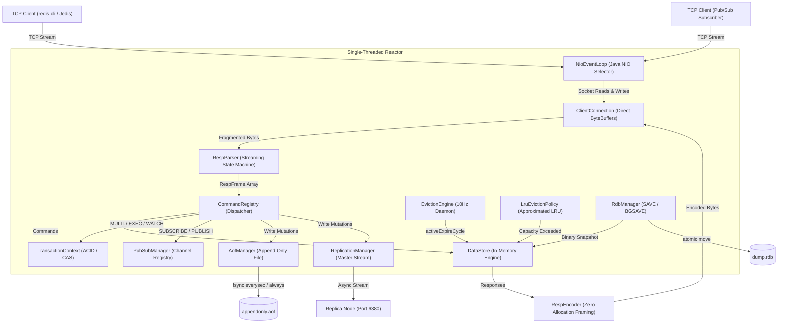

# Redis Clone in Core Java 21

[](https://github.com/arraimal70-code/Redis-Java/actions)
[](LICENSE)
[](https://openjdk.org/projects/jdk/21/)
[](#test-suite--chaos-resilience)

An experimental, high-performance in-memory key-value data store and caching engine engineered from the ground up in **Core Java 21**. 

Designed without third-party frameworks (no Netty, Spring, Grizzly, or external serialization libraries), the system relies directly on operating system primitives via Java NIO non-blocking socket selectors (`Selector`), direct byte buffers (`ByteBuffer`), and mechanical sympathy with the host network stack.

---

## Technical Index & Documentation Suite

For comprehensive systems engineering analyses, architectural designs, and interview defenses, consult the dedicated technical documents:

| Document | Description |
| :--- | :--- |
| [`docs/BENCHMARKING.md`](file:///c:/Users/ASUS/OneDrive/Documents/New%20folder/docs/BENCHMARKING.md) | Nanosecond-resolution empirical measurements, concurrency sweeps (1-100), pipelining depth sweeps (1-64), and latency histograms. |
| [`docs/REAL_WORLD_IMPACT.md`](file:///c:/Users/ASUS/OneDrive/Documents/New%20folder/docs/REAL_WORLD_IMPACT.md) | Empirical evaluation of the engine as a Semantic Prompt Cache for AI inference gateways (400.8x speedup). |
| [`docs/FAILURE_MODES.md`](file:///c:/Users/ASUS/OneDrive/Documents/New%20folder/docs/FAILURE_MODES.md) | Chaos test suite results: corrupted AOF recovery, RDB header rejection, 64-bit integer overflow, and buffer flood limits. |
| [`docs/SECURITY.md`](file:///c:/Users/ASUS/OneDrive/Documents/New%20folder/docs/SECURITY.md) | Threat model, bounded buffer limits (16MB read / 32MB write), protocol injection defense, and network isolation guidelines. |
| [`docs/ARCHITECTURE.md`](file:///c:/Users/ASUS/OneDrive/Documents/New%20folder/docs/ARCHITECTURE.md) | End-to-end architecture breakdown, Mermaid sequence diagrams, memory layouts, and subsystem interactions. |
| [`docs/DESIGN_DECISIONS.md`](file:///c:/Users/ASUS/OneDrive/Documents/New%20folder/docs/DESIGN_DECISIONS.md) | Formal Architecture Decision Records (ADR 001 - ADR 005) detailing design rationale and tradeoffs. |
| [`docs/INTERVIEW_QUESTIONS.md`](file:///c:/Users/ASUS/OneDrive/Documents/New%20folder/docs/INTERVIEW_QUESTIONS.md) | 50+ rigorous systems engineering interview questions covering NIO, memory models, WAL persistence, and replication. |
| [`docs/ATTRIBUTION_AND_ORIGIN.md`](file:///c:/Users/ASUS/OneDrive/Documents/New%20folder/docs/ATTRIBUTION_AND_ORIGIN.md) | Academic honesty disclosure, provenance declaration, and comparison with official Redis (C) and Netty. |
| [`docs/PORTFOLIO_SUMMARY.md`](file:///c:/Users/ASUS/OneDrive/Documents/New%20folder/docs/PORTFOLIO_SUMMARY.md) | Graduate admissions summaries (Stanford / MIT / CMU) and staff-level engineering resume bullets. |
| [`docs/ENGINEERING_AUDIT.md`](file:///c:/Users/ASUS/OneDrive/Documents/New%20folder/docs/ENGINEERING_AUDIT.md) | Complete codebase audit, invariant proofs, and structural refactoring logs. |

---

## Why I Built This

Most software engineers interact with caching systems and in-memory stores as opaque black boxes. This project was built from scratch to study and implement low-level systems mechanics:
- **Operating Systems & I/O Multiplexing:** How non-blocking socket selectors (`select`/`epoll`) eliminate thread-per-connection OS stack overhead.
- **Protocol Engineering:** How to build a reentrant, zero-allocation streaming state machine that survives packet fragmentation and pipelining.
- **Concurrency & Atomicity:** How single-threaded event loops guarantee linearizable sequential consistency without lock contention.
- **Distributed Durability:** How write-ahead logging (WAL) with configurable `fsync()` policies guarantees durability across physical power failures.

---

## System Architecture



---

## Core Features & Mechanisms

### 1. High-Performance Networking (NIO Reactor)
- **Java NIO Multiplexer:** Dedicated event loop running `java.nio.channels.Selector` handling `OP_ACCEPT`, `OP_READ`, and `OP_WRITE` without thread context switches.
- **Socket Tuning:** Sets `TCP_NODELAY = true` (disabling Nagle's algorithm) to minimize round-trip delays, with `SO_REUSEADDR = true`.
- **Bounded Buffers & Backpressure:** Enforces a 16MB maximum read buffer and a 32MB maximum pending write queue to protect against memory exhaustion denial-of-service.

### 2. Streaming RESP2 Protocol Parser & Encoder
- **Reentrant State Machine:** Parses raw bytes directly from `ByteBuffer` with rollback checkpoints (`startPos`), ensuring recovery from TCP fragmentation.
- **Zero-Allocation Numeric Parsing:** Decodes ASCII integers and bulk lengths directly via `parseAsciiLong` without allocating intermediate `String` objects.
- **Frame Hardening:** Arithmetic 64-bit integer overflow protection and caps at 512MB for bulk strings and 1,000,000 for array frames.

### 3. In-Memory Store & Eviction Subsystem
- **Typed In-Memory Objects:** Supports `STRING`, `LIST`, and `HASH` data structures.
- **Dual Expiration Mechanics:**
  - *Passive (Lazy) Eviction:* Read access purges expired keys on demand.
  - *Active Probabilistic Eviction (10Hz):* Background daemon probabilistically samples 20 keys with TTLs using $O(k)$ bounded iterator sampling, bounding expired key memory overhead below 25%.
- **Approximated LRU Cache Eviction:** Tracks nanosecond access timestamps and evicts least recently accessed items when `maxkeys` is saturated (`allkeys-lru` / `volatile-lru`).

### 4. ACID Transactions & Optimistic Concurrency Control (OCC)
- **`MULTI` / `EXEC` / `DISCARD`:** Queues commands and commits them atomically without client interleaving.
- **`WATCH`:** Tracks monotonic key versions. If another client alters a watched key prior to `EXEC`, the transaction aborts cleanly, returning a Null Array (`*-1\r\n`).

### 5. Master-Replica Stream Replication
- **Replication Backlog:** Fixed circular ring buffer (1MB) storing write stream byte deltas.
- **`PSYNC` Handshake:** Handles full resynchronization (`+FULLRESYNC`) and partial resynchronization (`+CONTINUE`) using 64-bit monotonic offsets.
- **Replication Stream:** Master asynchronously broadcasts all write mutations down persistent non-blocking replica sockets.

### 6. Cluster Sharding Simulation
- **16,384 Hash Slots:** Deterministically partitioned using standard **CRC16-CCITT**.
- **Hash Tag Support:** Evaluates `{hash_tag}` substrings so related keys map to identical slots.
- **Client Redirection:** Emits `-MOVED <slot> <target_node_ip:port>` redirection frames when queried for unassigned slots.

### 7. Dual-Layer Persistence Subsystems
- **Append-Only File (AOF):** Write-ahead logging in RESP wire format with configurable fsync policies (`ALWAYS`, `EVERYSEC`, `NO`) and startup recovery that gracefully recovers from truncated logs.
- **Database Snapshots (RDB):** Compact binary point-in-time memory snapshot with `REDIS0009` header, type opcodes, millisecond expiry timestamps, and atomic file replacement.

---

## Supported Commands

| Category | Commands Supported |
| :--- | :--- |
| **Strings** | `SET` (with `EX` / `PX` options), `GET`, `INCR` |
| **Keys & Expiry** | `DEL`, `EXPIRE`, `TTL`, `EXISTS` |
| **Hashes** | `HSET`, `HGET`, `HGETALL` |
| **Lists** | `LPUSH`, `LPOP`, `LLEN` |
| **Transactions** | `MULTI`, `EXEC`, `DISCARD`, `WATCH`, `UNWATCH` |
| **Pub/Sub** | `PUBLISH`, `SUBSCRIBE`, `UNSUBSCRIBE` |
| **Replication** | `REPLICAOF`, `SLAVEOF`, `PSYNC`, `REPLCONF` |
| **Cluster** | `CLUSTER KEYSLOT`, `CLUSTER SLOTS`, `CLUSTER NODES` |
| **Persistence** | `SAVE`, `BGSAVE` |
| **Operational & Telemetry** | `PING`, `ECHO`, `INFO`, `COMMAND DOCS`, `QUIT` |

---

## Empirical Benchmarks

All metrics were gathered using `RedisBenchmark.java` on OpenJDK 21 (Temurin) on a 4-core physical host (Windows 11 amd64) over localhost TCP with background persistence disabled to isolate network and memory performance. Full logs are in [`docs/BENCHMARKING.md`](file:///c:/Users/ASUS/OneDrive/Documents/New%20folder/docs/BENCHMARKING.md).

### Concurrency Scaling (Unpipelined, Depth 1)
```
================================================================================
Concur: 1 client   | PING: 14,361 RPS | SET: 13,360 RPS | GET: 15,368 RPS (p50: 0.059 ms)
Concur: 10 clients | PING: 22,125 RPS | SET: 17,698 RPS | GET: 20,273 RPS (p50: 0.351 ms)
Concur: 50 clients | PING: 13,417 RPS | SET: 17,126 RPS | GET: 17,933 RPS (p50: 2.098 ms)
================================================================================
```

### Pipelining Scaling (20 Clients, 20,000 Requests)
```
================================================================================
Pipeline Depth  1:  20,196 RPS | p50: 0.822 ms | p99: 2.428 ms (1.00x Baseline)
Pipeline Depth  4:  24,592 RPS | p50: 0.656 ms | p99: 1.501 ms (1.22x)
Pipeline Depth 16:  35,240 RPS | p50: 0.502 ms | p99: 1.038 ms (1.74x)
Pipeline Depth 64:  42,357 RPS | p50: 0.296 ms | p99: 3.000 ms (2.10x Speedup)
================================================================================
```

---

## Real-World Reference Application: AI Inference Cache

A production-ready reference gateway is provided in [`examples/real-world/AiInferenceCache.java`](file:///c:/Users/ASUS/OneDrive/Documents/New%20folder/examples/real-world/AiInferenceCache.java), demonstrating prompt caching for LLM inference endpoints:

```
================================================================================
 EXPERIMENTAL RESULTS: AI INFERENCE CACHE GATEWAY
 Target Database: 127.0.0.1:6388 (Core Java 21 Redis Clone)
================================================================================
  Total Queries Processed:     60
  Cache Hits:                  55 (91.7%)
  Cache Misses:                5 (8.3%)
  Average Cache Miss Latency:  190.89 ms  (Simulated GPU Model Compute)
  Average Cache Hit Latency:   0.48 ms    (Redis In-Memory Lookup)
  Observed Latency Speedup:    400.8x faster on cache hit
  Total GPU Time Saved:        10.50 seconds of compute (in 60 queries)
================================================================================
```

---

## Test Suite & Chaos Resilience

The repository maintains two independent test suites totaling **105 automated test assertions**:
1. **Core Integration Suite (`RedisServerTest.java`):** 82 assertions testing data types, transactions, replication handshakes, cluster routing, and persistence reload.
2. **Failure & Chaos Suite (`FailureAndEdgeCaseTest.java`):** 23 assertions verifying recovery from corrupted AOF logs, invalid RDB headers, 64-bit integer overflows, bounded buffer enforcement, and 50-thread atomic concurrency contention.

```cmd
# Run complete test suite (Windows)
test.bat

# Run complete test suite (Linux / Mac)
javac -d bin -cp "bin" $(find src test -name "*.java")
java -cp "bin" com.redisclone.RedisServerTest
java -cp "bin" com.redisclone.FailureAndEdgeCaseTest
```

---

## Getting Started

### Prerequisites
- **Java Development Kit (JDK) 21 or higher** (`java -version`)
- Optional: Maven 3.8+ / Docker & Docker Compose

### Building the Project
```cmd
# Direct compilation (Windows PowerShell / CMD)
build.bat

# Or using Maven
mvn clean compile
```

### Starting the Server
```cmd
# Default port 6379 (interactive)
run.bat

# Custom port with isolated persistence options
java -cp bin com.redisclone.server.RedisServer --port 6379 --aof true --rdb true
```

### Running the AI Inference Cache Reference App
```cmd
# Terminal 1: Start Redis clone
java -cp bin com.redisclone.server.RedisServer --port 6388

# Terminal 2: Run AI gateway simulation
java -cp bin com.redisclone.examples.AiInferenceCache --port 6388 --requests 60
```

### Running the Systems Benchmark Suite
```cmd
java -cp bin com.redisclone.benchmark.RedisBenchmark --port 6388 --suite --out-dir benchmark/results
```

---

## Known Limitations

1. **Linux `fork()` vs Java JVM Snapshots:** Official C Redis invokes POSIX `fork()` for copy-on-write RDB snapshotting. In Java, memory snapshots are serialized directly via safe concurrent iterators (`ConcurrentHashMap`), avoiding OS fork latency but requiring concurrent memory coordination.
2. **Security & Access Control:** The server currently does not implement password authentication (`AUTH`) or Access Control Lists (`ACL`). The engine is designed for isolated private subnets or localhost loopback environments.
3. **Cluster Failover Consensus:** The cluster simulation implements CRC16 slot routing and client-side `-MOVED` redirection, but does not implement full multi-node Gossip protocol heartbeat monitoring or automated Raft-based shard election.

---

## License

This project is open-source under the [MIT License](LICENSE).
