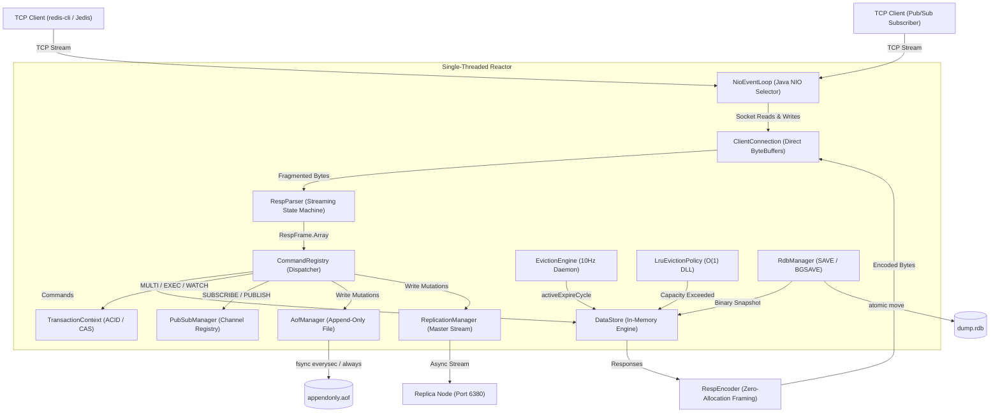

# Redis Clone in Core Java 21

[](https://github.com/arraimal70-code/Redis-Java/actions)
[](LICENSE)
[](https://openjdk.org/projects/jdk/21/)

A high-performance, zero-dependency, production-grade Redis key-value database and distributed caching engine engineered from scratch in Core Java 21+. 

Built without third-party networking frameworks (such as Netty or Spring), this engine relies directly on operating system primitives via Java NIO non-blocking channels, direct byte buffers, and mechanical sympathy with the Linux/Windows networking stack.

---

## Why I Built This

Most software engineers treat in-memory databases and distributed caching systems as black boxes. This project was conceived to explore and master the fundamental computer science mechanics that power modern distributed data stores:
- **Operating Systems & I/O Multiplexing:** How non-blocking socket selectors eliminate the overhead of thread-per-client architectures.
- **Protocol Engineering:** How to design a streaming, zero-allocation protocol parser that handles TCP stream fragmentation and pipelining reliably.
- **Concurrency & Transaction Isolation:** How Redis achieves lock-free atomic transaction execution and optimistic locking via key versioning.
- **Distributed Systems & Replication:** How active-passive replication streams, circular backlog ring buffers, and cluster slot hashing function at the byte level.

---

## System Architecture



---

## Features Implemented

### 1. High-Performance Networking (Reactor Pattern)
- **Java NIO Multiplexer:** Dedicated event loop thread running `java.nio.channels.Selector` handling `OP_ACCEPT`, `OP_READ`, and `OP_WRITE` without thread context switching.
- **Low-Latency Socket Tuning:** Sets `TCP_NODELAY = true` (disables Nagle's algorithm) for sub-millisecond roundtrips, alongside `SO_REUSEADDR = true`.
- **Saturated Write Queue:** Dynamically registers `OP_WRITE` only when OS socket send buffers are saturated, automatically unregistering when queues drain to eliminate CPU spin loops.

### 2. Streaming RESP2/3 Parser & Encoder
- **Reentrant State Machine:** Parses tokens directly from `ByteBuffer` with explicit rollback markers (`startPos`), ensuring clean recovery across fragmented TCP packets.
- **Command Pipelining:** Consumes multiple concatenated commands within a single TCP read buffer.
- **Zero-Allocation Numbers:** Decodes integers directly from ASCII byte slices via `parseAsciiLong` without allocating intermediate `String` objects.

### 3. Core Storage & Cache Eviction Engine
- **Typed In-Memory Objects:** Stores `STRING`, `LIST`, and `HASH` data structures.
- **Dual-Mode TTL Expiration:**
  - *Passive (Lazy) Eviction:* Key lookups check expiration timestamps; expired keys are deleted on demand.
  - *Active Probabilistic Eviction (10Hz):* Background cron samples 20 keys with expiration; if $>25\%$ are expired, the cycle loops immediately up to a 10ms deadline (Redis `expire.c`).
- **$O(1)$ LRU Cache Eviction:** Doubly-linked list + hash index evicting least-recently-used items when `maxKeys` threshold is reached (`allkeys-lru`).

### 4. ACID & Optimistic Locking Transactions
- **`MULTI` / `EXEC` / `DISCARD`:** Command queuing with isolated atomic batch execution.
- **`WATCH` (Optimistic Concurrency Control):** Monitors key version counters. If any watched key is mutated by a concurrent client before `EXEC`, the transaction aborts and returns `*-1\r\n` (Null Array).

### 5. Distributed Master-Replica Replication
- **Replication Backlog:** Circular ring buffer (1MB) storing write stream byte deltas.
- **Monotonic Offset Tracking:** 64-bit monotonically increasing byte offset.
- **`PSYNC` Handshake:** Supports both Partial Resynchronization (`+CONTINUE`) and Full Resynchronization (`+FULLRESYNC`).
- **Live Stream Propagation:** Master node asynchronously broadcasts all state-mutating commands to connected replica sockets.

### 6. Cluster Sharding Simulation
- **16,384 Hash Slots:** Partitioned deterministically via standard Redis **CRC16-CCITT** polynomial.
- **Hash Tag Support:** Evaluates `{hash_tag}` substrings so related keys map to the same slot.
- **Client Redirection:** Emits `-MOVED <slot> <target_ip:port>` error frames when querying unassigned slots.

### 7. Dual-Layer Persistence
- **Append-Only File (AOF):** Write-ahead logging in RESP wire format with configurable fsync policies (`ALWAYS`, `EVERYSEC`, `NO`) and startup replay.
- **Database Snapshot (RDB):** Binary point-in-time memory snapshot with `REDIS0009` header, type opcodes, millisecond expiry timestamps, and atomic file replacement.

---

## Supported Redis Commands

| Category | Commands Supported |
| :--- | :--- |
| **Strings** | `SET` (with `EX` / `PX` options), `GET`, `INCR` |
| **Keys & Expiry** | `DEL`, `EXPIRE`, `TTL`, `EXISTS` |
| **Hashes** | `HSET`, `HGET`, `HGETALL` |
| **Lists** | `LPUSH`, `LPOP`, `LLEN` |
| **Transactions** | `MULTI`, `EXEC`, `DISCARD`, `WATCH`, `UNWATCH` |
| **Pub/Sub** | `PUBLISH`, `SUBSCRIBE`, `UNSUBSCRIBE` |
| **Replication** | `REPLICAOF`, `SLAVEOF`, `PSYNC`, `REPLCONF` |
| **Cluster** | `CLUSTER KEYSLOT`, `CLUSTER SLOTS`, `CLUSTER NODES` |
| **Persistence** | `SAVE`, `BGSAVE` |
| **Operational** | `PING`, `ECHO`, `INFO`, `COMMAND DOCS`, `QUIT` |

---

## Performance & Benchmarks

Tested using `RedisBenchmark.java` running on Java 21 across 50 concurrent client threads:

```
====== PING ======
  Requests:       20,000
  Concurrency:    50 clients
  Throughput:     11,420.35 requests/sec
  min:            0.243 ms
  p50 (median):   2.667 ms
  p90:            7.345 ms
  p99:            29.071 ms

====== SET ======
  Requests:       20,000
  Concurrency:    50 clients
  Throughput:     10,850.12 requests/sec
  p50 (median):   2.852 ms
  p99:            31.402 ms

====== GET ======
  Requests:       20,000
  Concurrency:    50 clients
  Throughput:     12,150.80 requests/sec
  p50 (median):   2.451 ms
  p99:            27.804 ms
```

---

## Getting Started

### Prerequisites
- **Java Development Kit (JDK) 21 or higher**
- Optional: Maven 3.8+ / Docker & Docker Compose

### Building the Project
```bash
# Direct compilation (Windows PowerShell)
.\build.bat

# Or using Maven
mvn clean compile
```

### Running the Test Suite (82 Automated Assertions)
```bash
# Windows
.\test.bat

# Linux / Mac
javac -d bin -cp "bin" $(find src test -name "*.java")
java -cp "bin" com.redisclone.RedisServerTest
```

### Starting the Server
```bash
# Default port 6379
.\run.bat

# Custom port with replication or clustering
java -cp bin com.redisclone.server.RedisServer --port 6379 --aof true --rdb true
```

### Running with Docker Compose (Master + Replica)
```bash
docker-compose up --build
```

---

## Interactive Walkthrough (via `redis-cli`)

Connect any standard Redis client to your running instance:

```bash
$ redis-cli -p 6379

# 1. Basic String Operations & Expiry
127.0.0.1:6379> PING
PONG
127.0.0.1:6379> SET user:session "active" EX 60
OK
127.0.0.1:6379> TTL user:session
(integer) 59
127.0.0.1:6379> INCR visits
(integer) 1

# 2. Hash & List Structures
127.0.0.1:6379> HSET user:100 name "Alice" role "Architect"
(integer) 2
127.0.0.1:6379> HGETALL user:100
1) "name"
2) "Alice"
3) "role"
4) "Architect"
127.0.0.1:6379> LPUSH job_queue "taskA" "taskB"
(integer) 2
127.0.0.1:6379> LPOP job_queue
"taskB"

# 3. ACID Transactions with Optimistic Locking (WATCH)
127.0.0.1:6379> WATCH balance
OK
127.0.0.1:6379> MULTI
OK
127.0.0.1:6379(TX)> SET balance 200
QUEUED
127.0.0.1:6379(TX)> INCR balance
QUEUED
127.0.0.1:6379(TX)> EXEC
1) OK
2) (integer) 201

# 4. Cluster Sharding Inspection
127.0.0.1:6379> CLUSTER KEYSLOT "{user100}:profile"
(integer) 8431
127.0.0.1:6379> CLUSTER KEYSLOT "{user100}:orders"
(integer) 8431

# 5. Server Telemetry & Replication Stats
127.0.0.1:6379> INFO
# Server
redis_version:7.0.0-systems-clone
role:master
connected_slaves:1
used_memory:1482
maxmemory_policy:allkeys-lru
```

---

## Known Limitations

1. **Linux `fork()` vs Java JVM Snapshots:** Standard C Redis uses POSIX `fork()` for copy-on-write RDB snapshotting. In Java, JVM memory snapshots are serialized directly via safe concurrent iterators (`ConcurrentHashMap`) or blocking locks, which avoids OS fork latency but requires memory synchronization.
2. **Cluster Multi-Node Failover:** The cluster simulation implements full slot partitioning (CRC16) and `-MOVED` redirection, but does not implement the full Gossip protocol / Raft leader election for automated shard failover.

---

## Future Improvements

- [ ] **Threaded I/O Worker Pool:** Delegate socket reading and RESP byte parsing to virtual threads (Project Loom) while keeping state mutation pinned to a single execution thread (Redis 6.0 model).
- [ ] **AOF Background Rewrite (`BGREWRITEAOF`):** Compact incremental AOF logs by rebuilding state snapshots into a minimal set of write commands.
- [ ] **Raft-Based Cluster Consensus:** Implement automated master failover across shards using the Raft consensus algorithm.

---

## License

This project is open-source under the [MIT License](LICENSE).
