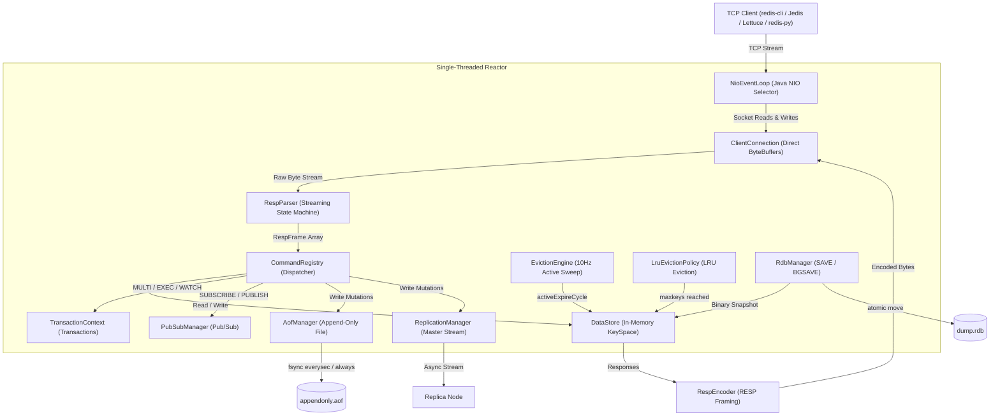

# Redis Clone in Core Java 21

[](https://github.com/arraimal70-code/Redis-Java/actions)
[](LICENSE)
[](https://openjdk.org/projects/jdk/21/)

An in-memory key-value data store implemented from scratch in **Core Java 21**, conforming to the Redis Serialization Protocol (RESP2).

The implementation relies strictly on the Java standard library (`java.nio`, `java.util.concurrent`, `java.io`, `java.net`) with **zero third-party runtime dependencies**. It implements non-blocking socket multiplexing via Java NIO `Selector`, a streaming state-machine RESP parser, dual-mode key expiration, LRU eviction, transactions, dual persistence engines (AOF + RDB), master-replica stream replication, and cluster hash-slot routing.

---

## Architecture Overview


```mermaid
graph TD
    Client["TCP Client (redis-cli / Jedis / Lettuce / redis-py)"] -->|TCP Stream| NioEventLoop["NioEventLoop (Java NIO Selector)"]

    subgraph Server Core [Single-Threaded Reactor]
        NioEventLoop -->|Socket Reads & Writes| ClientConn["ClientConnection (Direct ByteBuffers)"]
        ClientConn -->|Raw Byte Stream| RespParser["RespParser (Streaming State Machine)"]
        RespParser -->|RespFrame.Array| CommandRegistry["CommandRegistry (Dispatcher)"]

        CommandRegistry -->|Read / Write| DataStore["DataStore (In-Memory KeySpace)"]
        CommandRegistry -->|MULTI / EXEC / WATCH| TxContext["TransactionContext (Transactions)"]
        CommandRegistry -->|SUBSCRIBE / PUBLISH| PubSub["PubSubManager (Pub/Sub)"]
        CommandRegistry -->|Write Mutations| AofWriter["AofManager (Append-Only File)"]
        CommandRegistry -->|Write Mutations| ReplManager["ReplicationManager (Master Stream)"]

        EvictionEngine["EvictionEngine (10Hz Active Sweep)"] -->|activeExpireCycle| DataStore
        LruEngine["LruEvictionPolicy (LRU Eviction)"] -->|maxkeys reached| DataStore
        RdbEngine["RdbManager (SAVE / BGSAVE)"] -->|Binary Snapshot| DataStore
    end

    ReplManager -->|Async Stream| Replica["Replica Node"]
    AofWriter -->|fsync everysec / always| DiskAOF[("appendonly.aof")]
    RdbEngine -->|atomic move| DiskRDB[("dump.rdb")]
    DataStore -->|Responses| RespEncoder["RespEncoder (RESP Framing)"]
    RespEncoder -->|Encoded Bytes| ClientConn
```

### Key Subsystems

- **NIO Reactor (`com.redisclone.network`):** Single-threaded event loop utilizing `java.nio.channels.Selector` for non-blocking I/O multiplexing (`OP_ACCEPT`, `OP_READ`, `OP_WRITE`). Sockets are configured with `TCP_NODELAY` and bounded read (16MB) and write (32MB) buffers to enforce backpressure.
- **Streaming RESP Parser (`com.redisclone.resp`):** Reentrant state machine operating directly on `ByteBuffer` slices. Checkpoint rollback recovers from TCP packet fragmentation, and direct ASCII numeric parsing avoids intermediate string allocations.
- **In-Memory Storage (`com.redisclone.storage`):** `DataStore` backed by `ConcurrentHashMap<String, RedisObject>`. Supports Strings, Hashes, Lists, Sorted Sets (SkipList), Bitmaps, HyperLogLog, and Streams.
- **Sorted Sets (`SkipList.java`):** William Pugh multi-level SkipList ($p = 0.25$, 32 levels) with distance spans for $O(\log N)$ rank queries (`ZRANK`, `ZREVRANK`, `ZRANGE`, `ZREVRANGE`) and Level 0 backward pointers.
- **Expiration & Eviction (`com.redisclone.storage`):** Passive (lazy) expiration on read access combined with an active 10Hz probabilistic background sweep sampling 20 keys per cycle. Approximated LRU cache eviction when `maxkeys` is reached.
- **Transactions (`com.redisclone.command.impl`):** Atomic command queuing via `MULTI`/`EXEC`/`DISCARD` and optimistic concurrency control (CAS) via `WATCH` with key version tracking.
- **Dual Persistence (`com.redisclone.persistence`):**
  - **AOF:** Append-Only File with configurable fsync policies (`ALWAYS`, `EVERYSEC`, `NO`), background log compaction (`BGREWRITEAOF`), and crash-resilient truncated log replay.
  - **RDB:** Point-in-time binary snapshotting with `REDIS0009` header, type opcodes, millisecond expiry timestamps, and atomic file replacement.
- **Replication (`com.redisclone.replication`):** Master-Replica command propagation using a 1MB circular byte ring buffer (`ReplicationBacklog.java`), 64-bit monotonic offsets, and `PSYNC` partial/full resynchronization handshakes.
- **Cluster Slot Routing (`com.redisclone.cluster`):** 16,384 discrete slots partitioned via CRC16-CCITT with `{hash_tag}` extraction and `-MOVED` redirection frames.

---

## Supported Commands

The server implements **47 Redis commands**:

| Category | Commands Supported |
| :--- | :--- |
| **Strings** | `SET` (with `EX` / `PX`), `GET`, `INCR`, `MSET`, `MGET` |
| **Keys & Expiry** | `DEL`, `EXPIRE`, `TTL`, `EXISTS` |
| **Hashes** | `HSET`, `HGET`, `HGETALL` |
| **Lists** | `LPUSH`, `RPUSH`, `LPOP`, `RPOP`, `LLEN` |
| **Sorted Sets (ZSet)** | `ZADD`, `ZSCORE`, `ZCARD`, `ZCOUNT`, `ZRANK`, `ZREVRANK`, `ZRANGE`, `ZREVRANGE`, `ZREM` |
| **Bitmaps** | `SETBIT`, `GETBIT`, `BITCOUNT` |
| **HyperLogLog** | `PFADD`, `PFCOUNT` |
| **Streams** | `XADD`, `XLEN`, `XRANGE` |
| **Transactions** | `MULTI`, `EXEC`, `DISCARD`, `WATCH`, `UNWATCH` |
| **Pub/Sub** | `PUBLISH`, `SUBSCRIBE`, `UNSUBSCRIBE`, `PSUBSCRIBE`, `PUNSUBSCRIBE` |
| **Replication** | `REPLICAOF`, `SLAVEOF`, `PSYNC`, `REPLCONF` |
| **Cluster** | `CLUSTER KEYSLOT`, `CLUSTER SLOTS`, `CLUSTER NODES` |
| **Persistence** | `SAVE`, `BGSAVE`, `BGREWRITEAOF` |
| **Utility & Info** | `PING`, `ECHO`, `INFO`, `DBSIZE`, `FLUSHDB`, `FLUSHALL`, `AUTH`, `COMMAND`, `QUIT` |

For syntax, complexity, wire formats, and examples, see [`docs/COMMAND_REFERENCE.md`](docs/COMMAND_REFERENCE.md).

---

## Build & Run Instructions

### Prerequisites
- Java Development Kit (JDK) 21 or higher (`javac -version`, `java -version`)
- Optional: Maven 3.8+ / Docker

### Building the Project

**Windows (Batch):**
```cmd
build.bat
```

**Linux / macOS (Direct javac):**
```bash
mkdir -p bin
find src -name "*.java" > sources.txt
javac -d bin @sources.txt
rm -f sources.txt
```

**Using Maven:**
```bash
mvn clean compile
```

### Running the Server

**Windows (Default port 6379):**
```cmd
run.bat
```

**Direct Java Command:**
```bash
# Default configuration (port 6379, AOF and RDB enabled)
java -cp bin com.redisclone.server.RedisServer

# Custom configuration
java -cp bin com.redisclone.server.RedisServer --port 6379 --host 127.0.0.1 --aof true --rdb true

# Run as a replica
java -cp bin com.redisclone.server.RedisServer --port 6380 --replicaof 127.0.0.1 6379
```

#### CLI Configuration Flags

| Parameter | Default | Description |
| :--- | :--- | :--- |
| `--port <int>` | `6379` | TCP listening port |
| `--host <string>` | `0.0.0.0` | Network interface binding |
| `--replicaof <host> <port>` | `null` | Configure as a read-only replica of a master node |
| `--maxkeys <int>` | `0` (unlimited) | Keyspace capacity before LRU eviction triggers |
| `--cluster-enabled <bool>` | `false` | Enable CRC16 slot routing and `-MOVED` redirection |
| `--aof <bool>` | `true` | Enable Append-Only File persistence (`appendonly.aof`) |
| `--rdb <bool>` | `true` | Enable binary snapshot persistence (`dump.rdb`) |

### Running with Docker

**Build and Run Image:**
```bash
docker build -t redis-java .
docker run -p 6379:6379 redis-java
```

**Run Master + Replica via Docker Compose:**
```bash
docker compose up --build
```
This starts `redis-master` on port 6379 and `redis-replica` on port 6380 with automatic replication.

---

## Test Instructions

The project includes three automated test suites totaling **172 test assertions**:

1. **`RedisServerTest.java` (82 assertions):** Functional regression testing for RESP parsing, fragmentation, pipelining, transactions, replication, and persistence reload.
2. **`FailureAndEdgeCaseTest.java` (58 assertions):** Error handling and recovery testing for malformed frames, integer overflow, truncated AOF logs, corrupt RDB headers, bounded buffer limits, batch commands, and streams.
3. **`AdversarialTest.java` (32 assertions):** Stress testing covering byte-by-byte TCP fragmentation fuzzing, 100-thread concurrent CAS races, SkipList rank/span proofs, pattern Pub/Sub matching, and active TTL saturation.

**Run All Tests (Windows):**
```cmd
test.bat
```

**Run All Tests (Linux / macOS):**
```bash
mkdir -p bin
javac -d bin $(find src -name "*.java")
javac -d bin -cp bin $(find test -name "*.java")
java -cp bin com.redisclone.RedisServerTest
java -cp bin com.redisclone.FailureAndEdgeCaseTest
java -cp bin com.redisclone.AdversarialTest
```

**Automated Multi-Node Replication & Chaos Harness:**
```cmd
# Windows
scripts\chaos_cluster_test.bat

# Linux / macOS
./scripts/chaos_cluster_test.sh
```

---

## Benchmark Methodology & Results

Performance was evaluated using the built-in benchmarking suites on OpenJDK 21 (Temurin HotSpot JVM) on an 11th Gen Intel Core i5-1135G7 (4 physical cores, Windows 11). Tests were run over localhost TCP with persistence disabled (`--aof false --rdb false`) to isolate networking and memory engine throughput.

Detailed methodology and raw results are documented in [`docs/BENCHMARKING.md`](docs/BENCHMARKING.md).

### Component Microbenchmarks (`MicrobenchmarkSuite.java`)

| Measurement | Implementation | Latency (ns/op) | Throughput (ops/sec) |
| :--- | :--- | :--- | :--- |
| **RESP Numeric Parsing** | Custom ASCII parser (`parseAsciiLong`) | 35.3 ns/op | ~28.3M ops/sec |
| | JDK `Long.parseLong(new String(bytes))` | 116.9 ns/op | ~8.5M ops/sec |
| **CRC16 Hash Slot Calculation** | `Crc16.getSlot(byte[])` | 125.8 ns/op | ~7.9M slots/sec |
| **DataStore Memory Access** | `GET` lookup | 721.8 ns/op | ~1.39M reads/sec |
| | `SET` mutation | 731.9 ns/op | ~1.37M writes/sec |

### End-to-End Throughput & Latency (`RedisBenchmark.java`)

#### Concurrency Sweep (Pipeline Depth = 1, Payload = 16B)

| Workload | Concurrency | Throughput (RPS) | p50 Latency (ms) | p99 Latency (ms) |
| :--- | :---: | :---: | :---: | :---: |
| **PING** | 1 client | 14,361.28 | 0.061 ms | 0.181 ms |
| **SET** | 1 client | 13,360.15 | 0.067 ms | 0.222 ms |
| **GET** | 1 client | 15,368.53 | 0.061 ms | 0.181 ms |
| **PING** | 10 clients | 22,125.64 | 0.351 ms | 1.397 ms |
| **SET** | 10 clients | 17,698.78 | 0.425 ms | 2.225 ms |
| **GET** | 10 clients | 20,273.08 | 0.396 ms | 1.685 ms |

#### Pipelining Sweep (20 Clients, 20,000 Requests)

| Workload | Concurrency | Pipeline Depth | Throughput (RPS) | p50 Latency (ms) |
| :--- | :---: | :---: | :---: | :---: |
| **SET** | 20 | 1 | 20,196.79 | 0.822 ms |
| **SET** | 20 | 4 | 24,592.34 | 0.656 ms |
| **SET** | 20 | 16 | 35,240.58 | 0.502 ms |
| **SET** | 20 | 64 | **42,357.90** | **0.296 ms** |

---

## Technical Documentation

Detailed technical documents are available in [`docs/`](docs/):

- [**`docs/ARCHITECTURE.md`**](docs/ARCHITECTURE.md): Comprehensive systems design, sequence diagrams, memory layouts, and subsystem mechanics.
- [**`docs/DESIGN_DECISIONS.md`**](docs/DESIGN_DECISIONS.md): Architecture Decision Records (ADRs 001–008) and theoretical influences.
- [**`docs/COMMAND_REFERENCE.md`**](docs/COMMAND_REFERENCE.md): Complete reference for all 47 commands, complexity, and wire formats.
- [**`docs/BENCHMARKING.md`**](docs/BENCHMARKING.md): Benchmark methodology, environment specifications, and latency percentiles.
- [**`docs/SECURITY.md`**](docs/SECURITY.md): Threat model, buffer boundaries, integer overflow protections, and network isolation guidelines.

---

## Known Limitations

1. **Memory Footprint:** As a Java application, key-value entries incur JVM object header overhead (~32–48 bytes per entry) compared to raw C structs (`dictEntry`) managed by `jemalloc`.
2. **Access Control & TLS:** The server supports the `AUTH` command syntax for client compatibility, but does not enforce password verification, ACLs, or direct TLS. The engine should be deployed in private networks, local loopback, or behind a TLS-terminating sidecar proxy (e.g. Envoy).
3. **Cluster Protocol:** The cluster module implements CRC16 slot calculation and client-side `-MOVED` redirection, but does not implement the inter-node gossip cluster bus for automatic failover.
4. **Single-Reactor Execution:** Command execution occurs on the single event loop thread. Long-running operations (such as large range queries or synchronous snapshots) block concurrent clients until completion.

---

## License

This project is open-source under the [MIT License](LICENSE).
