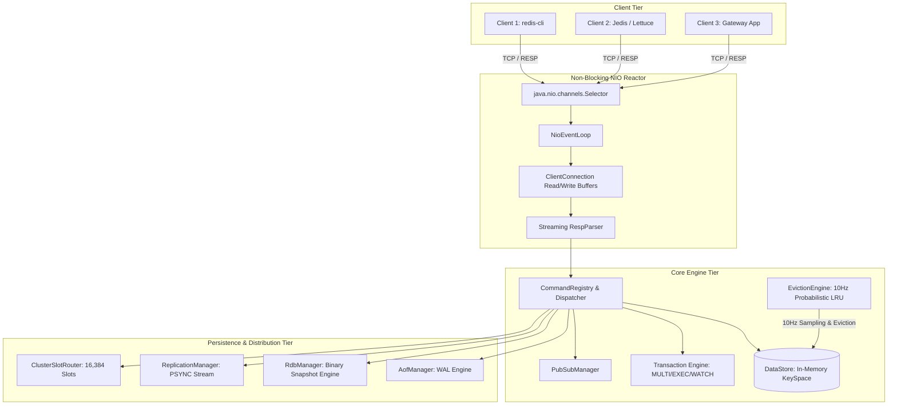
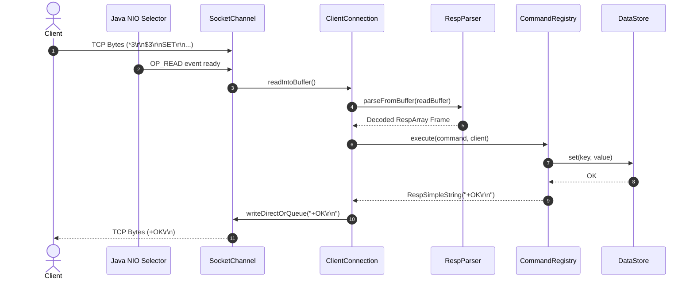

# Architecture & Systems Design Specification

## 1. System Overview

This project is a high-performance, in-memory, key-value data store implemented in Core Java 21, adhering strictly to the Redis Serialization Protocol (RESP2). It incorporates non-blocking network I/O, concurrent data structures, active and passive TTL eviction, atomic transactions, dual persistence engines (AOF + RDB), master-replica stream replication, and cluster hash-slot routing.

The design prioritizes zero third-party dependencies, low-latency execution, determinism under failure, and verifiable memory bounds.

---

## 2. Component Deconstruction

### 2.1 Non-Blocking Network Reactor (`com.redisclone.network`)
The network layer is anchored on Java NIO (`java.nio.channels.Selector` and `SocketChannel`).

- **Single Reactor Loop (`NioEventLoop.java`):** Runs an infinite event-driven selection loop. Channels register interest for `OP_ACCEPT`, `OP_READ`, and conditionally `OP_WRITE`.
- **Zero Thread-Per-Connection Overhead:** Unlike traditional blocking I/O which allocates an OS thread stack (typically 1MB) per client connection, the single-threaded selector manages thousands of persistent connections using bounded non-blocking direct buffers.
- **Backpressure & Queue Bounding (`ClientConnection.java`):**
  - Read buffer cap: **16 MB**.
  - Pending write queue cap: **32 MB**.
  - Direct socket writes are attempted synchronously first; unwritten bytes are registered for `OP_WRITE` notification, preventing reactor thread stalling.

### 2.2 RESP Protocol Parser (`com.redisclone.resp`)
The serialization layer implements RESP2 framing rules without relying on string tokenization (`String.split`), regex, or intermediate reflection:

- **Data Types Supported:**
  - `+` Simple String (e.g., `+OK\r\n`)
  - `-` Error (e.g., `-ERR unknown command\r\n`)
  - `:` Integer (64-bit signed integer)
  - `$` Bulk String (binary-safe payload, `$ -1\r\n` for nil)
  - `*` Array (recursive collection of frames)
- **Zero-Allocation Slicing:** Bulk strings and byte arrays are sliced directly from the direct `ByteBuffer` using relative index offsets, minimizing object allocation pressure on the Young Generation JVM heap.
- **Safety Boundaries:**
  - 64-bit overflow boundary checking on ASCII numeric parsing.
  - Maximum bulk string length: 512 MB.
  - Maximum array elements: 1,000,000.

### 2.3 In-Memory Storage & Eviction Engine (`com.redisclone.storage`)
- **Key-Value Store (`DataStore.java`):** Built upon `ConcurrentHashMap<String, RedisObject>`, enabling concurrent thread-safe access while preserving linearizability across single-threaded reactor iterations.
- **Dual Expiration Mechanism:**
  1. **Passive Expiration:** Every read access (`GET`, `EXISTS`, etc.) verifies whether the target key possesses an active TTL. If `currentTimeMillis > expireAt`, the key is immediately purged, and `nil` is returned.
  2. **Active Expiration (`EvictionEngine.java`):** A background daemon thread executes at 10Hz (every 100ms):
     - Probabilistically samples 20 keys with configured TTLs using bounded iterator stepping ($O(k)$ time complexity, avoiding full keyspace copying).
     - Evicts all expired keys found in the sample.
     - If $>25\%$ (5 keys) were expired, it immediately repeats the cycle to aggressively reclaim memory without blocking the network reactor.
- **LRU Cache Eviction:** When `maxkeys` is configured and capacity is saturated, the engine executes LRU eviction (`allkeys-lru` or `volatile-lru`), evicting the least recently accessed key based on nanosecond access timestamps.

### 2.4 Dual Persistence Subsystems (`com.redisclone.persistence`)

| Persistence Engine | Implementation | Durability Guarantee | Recovery Speed | File Format |
| :--- | :--- | :--- | :--- | :--- |
| **Append-Only File (AOF)** | `AofManager.java` | Configurable (`ALWAYS`, `EVERYSEC`, `NO`) via OS `fsync()` | Linear replay of write operations | Plaintext RESP commands |
| **RDB Snapshots** | `RdbManager.java` | Periodic point-in-time snapshot | Instant state hydration into `DataStore` | Binary format (`REDIS0009` header) |

- **AOF Partial Corruption Recovery:** If a crash or power cut truncates the final command in the AOF log, the replay engine detects the incomplete frame at EOF, commits all preceding valid operations, and issues a warning instead of failing startup.

### 2.5 Master-Replica Replication Engine (`com.redisclone.replication`)
- **Handshake Protocol:** Replicas connect to the master using non-blocking sockets, transmitting a `PSYNC ? -1` handshake.
- **Replication Stream:** The master registers replica channels in `ReplicationManager`. All write mutations (`SET`, `DEL`, `INCR`, `LPUSH`) applied to the master's keyspace are automatically serialized into RESP byte buffers and broadcast down the replication stream to all connected replicas.
- **Role Enforcement:** Replicas enforce read-only semantics; write operations directed to a replica are rejected with `-READONLY You cannot write against a read only replica.`

### 2.6 Transaction Engine (`com.redisclone.command.impl.TransactionCommands`)
- **ACID & CAS Semantics:** Supports `MULTI`, `EXEC`, `DISCARD`, and `WATCH`.
- **Command Queuing:** Upon entering `MULTI` mode, subsequent client commands are queued in memory without mutation.
- **Optimistic Concurrency Control (OCC / CAS):** Keys monitored via `WATCH` record their version state. If another client mutates a watched key prior to `EXEC`, the transaction aborts atomically, returning a Null Array (`*-1\r\n`).

### 2.7 Cluster Hash-Slot Routing (`com.redisclone.cluster`)
- Implements CRC16 hash-slot routing across **16,384 discrete slots**:
  $$\text{slot} = \text{CRC16}(\text{key}) \pmod{16384}$$
- Supports `{hash_tag}` extraction (e.g., `{user100}:profile` hashes only `user100`).
- If cluster mode is enabled and a queried key falls outside the node's configured slot range, the server responds with a standard cluster redirection frame: `-MOVED <slot> <targetHost>:<targetPort>`.
