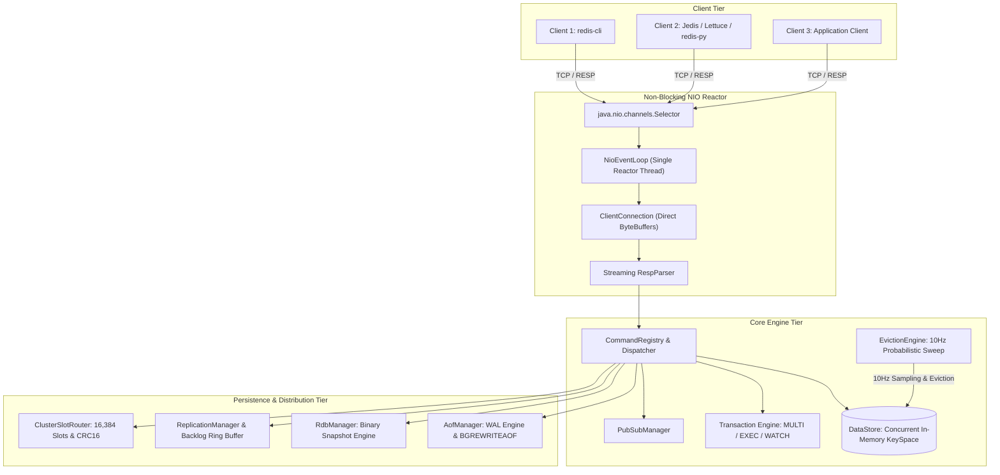
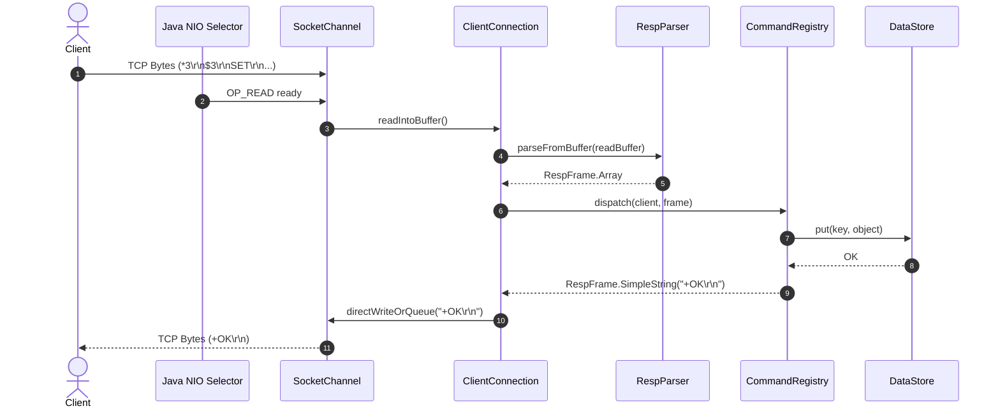
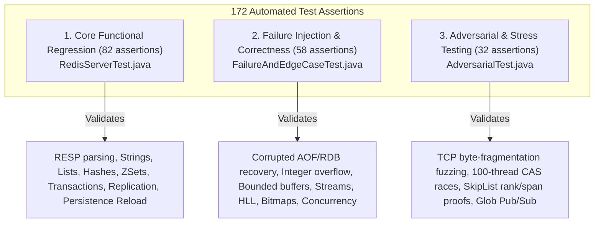

# Architecture & Systems Design Specification

## 1. System Overview

This project is an in-memory key-value data store implemented in Core Java 21, conforming to the Redis Serialization Protocol (RESP2). The system incorporates non-blocking network I/O, concurrent data structures, active and passive TTL expiration, atomic transactions, dual persistence engines (AOF + RDB), master-replica stream replication, and cluster hash-slot routing.

The design relies entirely on the Java standard library (`java.nio`, `java.util.concurrent`, `java.io`, `java.net`) with zero third-party runtime dependencies.

```mermaid
graph TD
    subgraph Client Tier
        C1["Client 1: redis-cli"]
        C2["Client 2: Jedis / Lettuce / redis-py"]
        C3["Client 3: Application Client"]
    end

    subgraph Network Tier [Non-Blocking NIO Reactor]
        EL["NioEventLoop (Single Reactor Thread)"]
        Sel["java.nio.channels.Selector"]
        CC["ClientConnection (Direct ByteBuffers)"]
        Parser["Streaming RespParser"]
    end

    subgraph Core Engine Tier
        CR["CommandRegistry & Dispatcher"]
        DS[("DataStore: Concurrent In-Memory KeySpace")]
        EE["EvictionEngine: 10Hz Probabilistic Sweep"]
        TX["Transaction Engine: MULTI / EXEC / WATCH"]
        PS["PubSubManager"]
    end

    subgraph Persistence & Distribution Tier
        AOF["AofManager: WAL Engine & BGREWRITEAOF"]
        RDB["RdbManager: Binary Snapshot Engine"]
        REP["ReplicationManager & Backlog Ring Buffer"]
        CLUST["ClusterSlotRouter: 16,384 Slots & CRC16"]
    end

    C1 -->|TCP / RESP| Sel
    C2 -->|TCP / RESP| Sel
    C3 -->|TCP / RESP| Sel

    Sel --> EL
    EL --> CC
    CC --> Parser
    Parser --> CR

    CR --> DS
    CR --> TX
    CR --> PS
    CR --> AOF
    CR --> RDB
    CR --> REP
    CR --> CLUST

    EE -->|10Hz Sampling & Eviction| DS
```

---

## 2. Component Architecture

### 2.1 Non-Blocking Network Reactor (`com.redisclone.network`)

The network layer uses Java NIO (`java.nio.channels.Selector` and `SocketChannel`) following the Single-Reactor pattern:

- **Single Reactor Loop (`NioEventLoop.java`):** A single thread executes an event-driven multiplexing loop (`Selector.select(50)`). Channels register interest for `OP_ACCEPT`, `OP_READ`, and conditionally `OP_WRITE`. This eliminates thread-per-connection OS stack overhead (typically 1MB per thread in standard blocking I/O) and ensures linearizable, sequential command execution without locking across the command path.
- **Socket Configuration:**
  - `configureBlocking(false)`: Prevents thread blocking on socket I/O.
  - `StandardSocketOptions.TCP_NODELAY = true`: Disables Nagle's algorithm, transmitting frames immediately.
  - `StandardSocketOptions.SO_REUSEADDR = true`: Permits immediate port re-binding upon server restart.
- **Backpressure & Bounded Buffers (`ClientConnection.java`):**
  - Read buffer limit: **16 MB**. Connections streaming un-delimited bytes exceeding this limit are terminated to prevent memory exhaustion.
  - Pending write queue limit: **32 MB**. Slow consumer clients whose pending response queue exceeds 32 MB are disconnected to protect heap stability.
  - Saturated write handling: Responses are first attempted via direct non-blocking write (`channel.write(buffer)`). If the OS socket send buffer is full, unwritten bytes are enqueued and interest in `SelectionKey.OP_WRITE` is registered. Once the socket becomes writable again, the queue is drained and `OP_WRITE` is immediately unregistered to prevent CPU busy-spinning.

```mermaid
sequenceDiagram
    autonumber
    actor Client
    participant Selector as Java NIO Selector
    participant Channel as SocketChannel
    participant Conn as ClientConnection
    participant Parser as RespParser
    participant Registry as CommandRegistry
    participant Store as DataStore

    Client->>Channel: TCP Bytes (*3\r\n$3\r\nSET\r\n...)
    Selector->>Channel: OP_READ ready
    Channel->>Conn: readIntoBuffer()
    Conn->>Parser: parseFromBuffer(readBuffer)
    Parser-->>Conn: RespFrame.Array
    Conn->>Registry: dispatch(client, frame)
    Registry->>Store: put(key, object)
    Store-->>Registry: OK
    Registry-->>Conn: RespFrame.SimpleString("+OK\r\n")
    Conn->>Channel: directWriteOrQueue("+OK\r\n")
    Channel-->>Client: TCP Bytes (+OK\r\n)
```

---

### 2.2 Streaming RESP Protocol State Machine (`com.redisclone.resp`)

The protocol layer implements RESP2 framing directly on `ByteBuffer` without intermediate string splitting or regex parsing:

- **Data Types Supported:**
  - `+` Simple String (`+OK\r\n`, `+PONG\r\n`)
  - `-` Error (`-ERR unknown command\r\n`)
  - `:` Integer (64-bit signed integer)
  - `$` Bulk String (binary-safe payload, `$-1\r\n` for nil)
  - `*` Array (collection of frames, `*-1\r\n` for nil array)
- **Reentrant State Machine with Rollback:**
  - The parser marks `startPos = buffer.position()` before attempting to decode a token.
  - If a frame is incomplete due to TCP segmentation (e.g., partial bulk string payload or missing `\r\n`), the parser resets the buffer position to `startPos` (`buffer.position(startPos)`) and returns `null`. The socket channel retains unconsumed bytes in place until subsequent network packets arrive.
- **Zero-Allocation Numeric Parsing:**
  - `parseAsciiLong(bytes, offset, length)` parses ASCII integers and bulk string lengths directly from raw bytes, avoiding intermediate `String` object instantiation.
  - Includes arithmetic boundary checks to detect and prevent 64-bit integer overflow (`Long.MAX_VALUE`).
- **Protocol Safety Boundaries:**
  - Maximum bulk string length: 512 MB.
  - Maximum array elements: 1,000,000.

---

### 2.3 Storage Engine & Data Structures (`com.redisclone.storage`)

The keyspace is managed by `DataStore.java`, backed by `ConcurrentHashMap<String, RedisObject>`. Each key points to a typed `RedisObject` enclosing one of the core supported data structures:

#### Supported Data Types:
1. **Strings (`RedisType.STRING`):** Backed by `String` or binary byte arrays.
2. **Hashes (`RedisType.HASH`):** Backed by `Map<String, String>` supporting field-level lookups and modifications (`HSET`, `HGET`, `HGETALL`).
3. **Lists (`RedisType.LIST`):** Backed by `Deque<String>` supporting head and tail operations (`LPUSH`, `RPUSH`, `LPOP`, `RPOP`, `LLEN`).
4. **Sorted Sets (`RedisType.ZSET`):** Hybrid data structure pairing an $O(1)$ Hash Map (`Map<String, Double>`) with a 32-level William Pugh SkipList (`SkipList.java`).
5. **Bitmaps (`RedisType.BITMAP`):** Byte array bitfield supporting bit-level manipulation (`SETBIT`, `GETBIT`, `BITCOUNT`).
6. **HyperLogLog (`RedisType.HYPERLOGLOG`):** Probabilistic cardinality estimator (`HyperLogLog.java`).
7. **Streams (`RedisType.STREAM`):** Monotonically ordered log of structured events (`StreamEntry.java`).

#### SkipList Mechanics (`SkipList.java` & `SortedSet.java`):
- Implements William Pugh's multi-level SkipList ($p = 0.25$, $\text{MaxLevel} = 32$).
- **Rank Spans:** Forward pointers at each level store a distance span (the number of Level 0 steps skipped). This allows $O(\log N)$ rank lookups (`ZRANK`, `ZREVRANK`) and percentile/range lookups by rank (`getNodeByRank`).
- **Backward Pointers:** Level 0 maintains bidirectional pointers (`backward`), permitting $O(1)$ reverse sequential traversal (`ZREVRANGE`).
- **Total Ordering:** Elements are ordered by score ascending; ties in score are broken by lexicographical member comparison.

#### HyperLogLog Mechanics (`HyperLogLog.java`):
- Implements 64 registers ($m = 64$) with 6-bit register values.
- Hashes input members using 64-bit Murmur-style hashing to extract a 6-bit register index ($2^6 = 64$) and count the run of leading zeros in the remaining 58 bits.
- Cardinality estimation applies Flajolet's harmonic mean formula with small-range linear counting correction when zero registers exist:
  $$E = \alpha_m \cdot m^2 \cdot \left(\sum_{j=1}^m 2^{-R[j]}\right)^{-1}$$

#### Redis Streams (`StreamEntry.java`):
- Monotonic IDs formatted as `<timestampMs>-<sequenceNumber>`. If sequence number is omitted or specified as `*`, sequence numbers increment monotonically for entries arriving within the same millisecond.
- Supports field-value tuple storage and continuous range querying via `XRANGE`.

---

### 2.4 TTL Expiration & Eviction Engine (`com.redisclone.storage`)

The system implements a dual-mode expiration architecture modeled after Redis's `expire.c`:

1. **Passive (Lazy) Expiration:** Every key read operation (`GET`, `EXISTS`, `HGET`, etc.) evaluates whether the key has an associated expiration timestamp. If `currentTimeMillis >= expireAt`, the key is immediately purged from both the main keyspace and expiration dictionary, and a `nil` reply is returned.
2. **Active Probabilistic Eviction (`EvictionEngine.java`):** A dedicated background thread executes at 10Hz (every 100ms):
   - Samples 20 keys with configured TTLs using bounded iterator stepping ($O(k)$ time complexity, avoiding full keyspace array copies).
   - Evicts all expired keys identified in the sample.
   - If $>25\%$ (more than 5 keys) in the sample were expired, it immediately repeats the sampling cycle up to a bounded iteration limit, aggressively reclaiming memory without stalling the reactor.
3. **Capacity-Based LRU Eviction (`LruEvictionPolicy.java`):**
   - When `maxkeys` is configured and capacity is saturated, the engine executes LRU eviction (`allkeys-lru` or `volatile-lru`).
   - Tracks nanosecond access timestamps and evicts least recently accessed entries to maintain bounded memory capacity.

---

### 2.5 Dual-Layer Persistence Engine (`com.redisclone.persistence`)

| Persistence Engine | Implementation | Durability Guarantee | Recovery Mechanism | Format |
| :--- | :--- | :--- | :--- | :--- |
| **Append-Only File (AOF)** | `AofManager.java` | Configurable (`ALWAYS`, `EVERYSEC`, `NO`) via OS `FileChannel.force()` | Sequential replay of mutating RESP commands | Plaintext RESP commands |
| **RDB Snapshots** | `RdbManager.java` | Point-in-time binary snapshot on command or shutdown | Direct deserialization into `DataStore` | Binary format (`REDIS0009` header) |

- **AOF fsync Policies:**
  - `ALWAYS`: Forces write-ahead log sync to disk after every mutating command.
  - `EVERYSEC`: Writes to OS page cache synchronously; a background scheduled executor flushes via `force(false)` once per second.
  - `NO`: Leaves flushing to the underlying operating system buffer cache.
- **Crash Recovery & Truncation Handling:** If a power loss or process termination truncates the final command in `appendonly.aof`, the replay parser detects the incomplete frame at EOF, commits all preceding valid transactions, logs a warning, and allows the server to start safely.
- **AOF Compaction (`BGREWRITEAOF`):** Asynchronously rewrites the current in-memory state into a compacted temporary AOF file, emitting minimal snapshot commands (`SET`, `RPUSH`, `HSET`, `ZADD`) for active keys and replacing the old log via an atomic file rename (`StandardCopyOption.ATOMIC_MOVE`).
- **RDB Snapshotting:** Serializes keyspace state with `REDIS0009` magic header, type opcodes (`0x00` String, `0x01` List, `0x02` Hash, `0x03` Set, `0x04` ZSet, `0x05` Stream), millisecond TTL timestamps (`0xFC`), database selectors (`0xFE`), and EOF delimiter (`0xFF`). Writes to a temporary file and renames atomically with Windows retry backoff.

---

### 2.6 Master-Replica Replication Engine (`com.redisclone.replication`)

- **Replication Backlog (`ReplicationBacklog.java`):** A fixed 1MB circular byte ring buffer tracking monotonic 64-bit offsets. Writes from mutating commands are appended to the backlog stream.
- **Handshake Protocol:**
  1. A replica connects to the master and issues `PING`.
  2. The replica identifies its listening port via `REPLCONF listening-port <port>`.
  3. The replica transmits `PSYNC <master_replid> <offset>`.
  4. The master verifies whether the requested offset falls within its replication backlog window:
     - **Partial Resync:** If the offset is within the backlog, the master responds with `+CONTINUE` and streams only the missing byte delta from the ring buffer.
     - **Full Resync:** If the offset is unknown or expired, the master responds with `+FULLRESYNC <master_replid> <offset>` and synchronizes the keyspace.
- **Role Enforcement:** Replicas enforce read-only semantics. Mutating commands directed to a replica are rejected with `-READONLY You cannot write against a read only replica.`

---

### 2.7 Transaction Engine (`com.redisclone.command.impl.TransactionCommands`)

- **Command Queuing:** Upon receiving `MULTI`, the client connection enters transaction mode. Subsequent commands are verified and appended to an in-memory queue (`TransactionContext.java`), returning `+QUEUED\r\n`.
- **Atomic Execution:** When `EXEC` is invoked, queued commands execute sequentially on the single reactor thread without interleaving from concurrent clients.
- **Optimistic Concurrency Control (WATCH / CAS):**
  - Clients can register interest in keys via `WATCH key [key ...]`.
  - The server tracks a monotonic version counter for every key in `DataStore`.
  - If any watched key is mutated prior to `EXEC`, the transaction aborts atomically, returning a Null Array (`*-1\r\n`).
  - `DISCARD` clears queued commands and resets watch state.

---

### 2.8 Cluster Hash-Slot Routing (`com.redisclone.cluster`)

- **16,384 Discrete Slots:** Keys are mapped to slots using CRC16-CCITT:
  $$\text{slot} = \text{CRC16}(\text{key}) \pmod{16384}$$
- **Hash Tag Extraction:** If a key contains `{...}` (e.g., `{user100}:profile`), only the text within the first matching curly braces is hashed. This ensures co-location of related keys onto the same slot.
- **Client Redirection:** When cluster mode is enabled (`--cluster-enabled true`), queries for keys outside the local node's assigned slot range are rejected with a standard cluster redirection frame: `-MOVED <slot> <targetHost>:<targetPort>`.

---

## 3. Server Configuration & Runtime Parameters

The server is configured via CLI arguments or programmatic instantiation of `ServerConfig.java`:

| Parameter | Type | Default | Description |
| :--- | :--- | :--- | :--- |
| `--port <int>` | Integer | `6379` | TCP port for the Java NIO reactor event loop. |
| `--host <string>` | String | `0.0.0.0` | Network interface binding (`127.0.0.1` for loopback). |
| `--replicaof <host> <port>` | String, Integer | `null` | Configures node as a replica of the specified master. |
| `--maxkeys <int>` | Integer | `0` (unlimited) | Maximum keyspace capacity before LRU eviction triggers. |
| `--cluster-enabled <bool>` | Boolean | `false` | Enables CRC16 slot routing and `-MOVED` redirection. |
| `--aof <bool>` | Boolean | `true` | Enables Append-Only File persistence (`appendonly.aof`). |
| `--rdb <bool>` | Boolean | `true` | Enables binary snapshot persistence (`dump.rdb`). |

---

## 4. Verification & Testing Architecture

The codebase is verified through three automated test suites comprising **172 test assertions**:

```mermaid
graph TD
    subgraph Testing Rings [172 Automated Test Assertions]
        Ring1["1. Core Functional Regression (82 assertions)<br>RedisServerTest.java"]
        Ring2["2. Failure Injection & Correctness (58 assertions)<br>FailureAndEdgeCaseTest.java"]
        Ring3["3. Adversarial & Stress Testing (32 assertions)<br>AdversarialTest.java"]
    end

    Ring1 -->|Validates| T1["RESP parsing, Strings, Lists, Hashes, ZSets, Transactions, Replication, Persistence Reload"]
    Ring2 -->|Validates| T2["Corrupted AOF/RDB recovery, Integer overflow, Bounded buffers, Streams, HLL, Bitmaps, Concurrency"]
    Ring3 -->|Validates| T3["TCP byte-fragmentation fuzzing, 100-thread CAS races, SkipList rank/span proofs, Glob Pub/Sub"]
```

1. **Core Functional Regression (`RedisServerTest.java`):** 82 assertions testing data types, transactions, replication handshakes, cluster routing, and persistence recovery.
2. **Failure Injection & Correctness (`FailureAndEdgeCaseTest.java`):** 58 assertions verifying recovery from corrupted AOF logs, AOF compaction replay, invalid RDB headers, 64-bit integer overflow protection, bounded buffer enforcement, batch commands (`MSET`/`MGET`), `DBSIZE`, `FLUSHDB`, `AUTH`, Bitmaps, HyperLogLog, Streams, and concurrent access.
3. **Adversarial & Stress Testing (`AdversarialTest.java`):** 32 assertions verifying byte-level TCP packet fragmentation fuzzing, 100-thread concurrent CAS races, SkipList rank and distance span invariants across 2,000 operations, pattern-based Pub/Sub (`PSUBSCRIBE`) glob matching, active 10Hz TTL expiration saturation, and buffer DoS boundaries.
