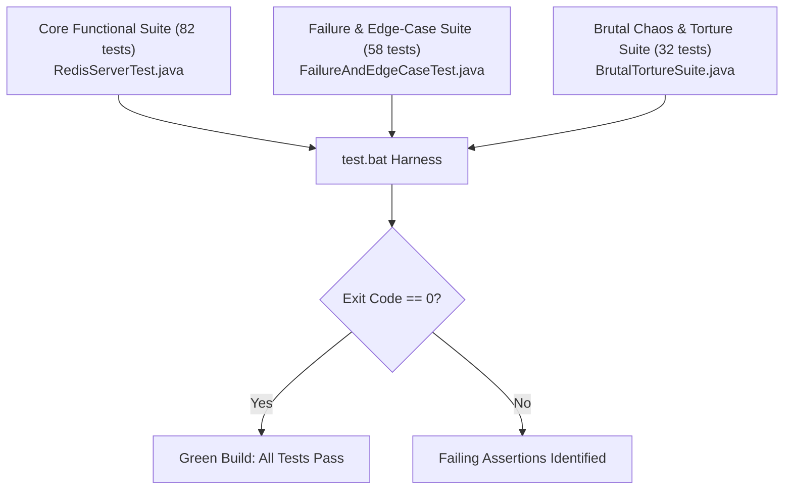

# Developer & Contributor Guide: Extending the Engine

This guide provides instructions for software engineers extending, benchmarking, testing, and contributing to the Core Java 21 Redis Clone codebase.

---

## 1. Development Environment Setup

### 1.1 Prerequisites
- **Java Development Kit (JDK) 21 or higher** (`javac -version`, `java -version`)
- **Maven 3.8+** (optional, standard javac compilation works directly)
- **Git**

### 1.2 Compiling the Codebase
Direct compilation without Maven dependencies:
```cmd
# Windows
build.bat

# Linux / macOS
mkdir -p bin
javac -d bin $(find src -name "*.java")
```

---

## 2. Codebase Organization & Package Hierarchy

```text
src/com/redisclone/
├── benchmark/               # Nanosecond-resolution benchmarking suites
│   ├── MicrobenchmarkSuite.java
│   └── RedisBenchmark.java
├── cluster/                 # CRC16-CCITT sharding & -MOVED redirection
│   ├── ClusterSlotRouter.java
│   └── Crc16.java
├── command/                 # Command interface, registry & dispatch table
│   ├── Command.java
│   ├── CommandContext.java
│   ├── CommandRegistry.java
│   ├── TransactionContext.java
│   └── impl/                # Modular command implementations
│       ├── BitmapCommands.java
│       ├── ClusterCommands.java
│       ├── HashCommands.java
│       ├── HyperLogLogCommands.java
│       ├── KeyCommands.java
│       ├── ListCommands.java
│       ├── PubSubCommands.java
│       ├── ReplicationCommands.java
│       ├── StreamCommands.java
│       ├── StringCommands.java
│       ├── TransactionCommands.java
│       ├── UtilityCommands.java
│       └── ZSetCommands.java
├── network/                 # Java NIO Reactor & Socket abstractions
│   ├── ClientConnection.java
│   ├── FrameHandler.java
│   └── NioEventLoop.java
├── persistence/             # WAL (AOF) and snapshot (RDB) engines
│   ├── AofManager.java
│   └── RdbManager.java
├── pubsub/                  # Channel & glob pattern subscription engine
│   └── PubSubManager.java
├── replication/             # Circular ring buffer & PSYNC replication
│   ├── ReplicationBacklog.java
│   └── ReplicationManager.java
├── resp/                    # RESP2 protocol parser & zero-allocation encoder
│   ├── RespEncoder.java
│   ├── RespFrame.java
│   ├── RespParser.java
│   └── RespType.java
├── server/                  # Bootstrapping orchestration & server metrics
│   ├── RedisServer.java
│   ├── ServerConfig.java
│   └── ServerMetrics.java
└── storage/                 # In-memory dictionaries & data structures
    ├── DataStore.java
    ├── EvictionEngine.java
    ├── HyperLogLog.java
    ├── RedisObject.java
    ├── RedisType.java
    ├── SkipList.java
    ├── SortedSet.java
    ├── StreamEntry.java
    └── eviction/
        ├── EvictionPolicy.java
        ├── LruEvictionPolicy.java
        └── NoEvictionPolicy.java
```

---

## 3. Tutorial: Adding a New Command in 15 Minutes

Let us walk through adding the `STRLEN key` command (returns string length).

### Step 1: Implement the Command Class
Open [`src/com/redisclone/command/impl/StringCommands.java`](file:///c:/Users/ASUS/OneDrive/Documents/New%20folder/src/com/redisclone/command/impl/StringCommands.java) and add the inner class:

```java
public static class StrLenCommand implements Command {
    @Override
    public RespFrame execute(CommandContext ctx, List<byte[]> args) {
        if (args.size() != 1) {
            return RespFrame.ofError("ERR wrong number of arguments for 'strlen' command");
        }

        String key = new String(args.get(0), StandardCharsets.UTF_8);
        RedisObject obj = ctx.getDataStore().get(key);

        if (obj == null) {
            return RespFrame.ofInteger(0);
        }

        try {
            byte[] bytes = obj.asStringBytes();
            return RespFrame.ofInteger(bytes.length);
        } catch (IllegalStateException e) {
            return RespFrame.ofError(e.getMessage());
        }
    }
}
```

### Step 2: Register in `CommandRegistry`
Open [`src/com/redisclone/command/CommandRegistry.java`](file:///c:/Users/ASUS/OneDrive/Documents/New%20folder/src/com/redisclone/command/CommandRegistry.java) in `registerDefaultCommands()`:

```java
commands.put("STRLEN", new StringCommands.StrLenCommand());
```

### Step 3: Write Automated Test Assertions
Open [`test/com/redisclone/RedisServerTest.java`](file:///c:/Users/ASUS/OneDrive/Documents/New%20folder/test/com/redisclone/RedisServerTest.java) and add:

```java
// Test STRLEN on existing key
client.send("SET greeting \"Hello World\"");
assertEquals("+OK", client.read());
client.send("STRLEN greeting");
assertEquals(":11", client.read());

// Test STRLEN on missing key
client.send("STRLEN non_existing");
assertEquals(":0", client.read());
```

### Step 4: Recompile and Run Verification
```cmd
build.bat
test.bat
```

---

## 4. Verification & Testing Framework

The repository maintains **172 automated test assertions** divided into three specialized suites:



### 4.1 Test Suites Breakdown
1. **Core Integration Suite (`RedisServerTest.java`):**
   - 82 assertions testing data types, transactions, replication handshakes, cluster routing, and persistence reload.
2. **Failure & Chaos Suite (`FailureAndEdgeCaseTest.java`):**
   - 58 assertions verifying recovery from corrupted AOF logs, AOF compaction replay, invalid RDB headers, 64-bit integer overflows, bounded buffer enforcement, batch commands (`MSET`/`MGET`), `DBSIZE`, `FLUSHDB`, `AUTH`, Bitmaps (`SETBIT`/`GETBIT`/`BITCOUNT`), HyperLogLog cardinality (`PFADD`/`PFCOUNT`), Redis Streams (`XADD`/`XLEN`/`XRANGE`), and 50-thread atomic concurrency contention.
3. **Brutal Chaos & Torture Suite (`BrutalTortureSuite.java`):**
   - 32 assertions subjecting the engine to byte-level TCP packet fragmentation fuzzing, 100-thread CAS race torture, William Pugh SkipList distance-span rank invariant proofs (2,000 randomized operations), glob pattern Pub/Sub fuzzing (`PSUBSCRIBE`), and high-velocity active 10Hz TTL expiration saturation.

### 4.2 Running the Suites
```cmd
# Run complete automated verification
test.bat

# Run multi-node chaos cluster fault injection
scripts\chaos_cluster_test.bat
```

---

## 5. Microbenchmarking Guidelines

Run nanosecond microbenchmarks on HotSpot C2 Tier 4 JIT compiler:
```cmd
java -cp bin com.redisclone.benchmark.MicrobenchmarkSuite
```

Outputs performance profiles across:
- Zero-Allocation RESP Numeric Parsing
- William Pugh SkipList Insertion & Rank Lookups
- CRC16-CCITT Cluster Slot Routing
- In-Memory DataStore Key Lookups

---

## 6. Engineering Conventions & Invariant Checklist

When contributing code:
1. **Zero External Dependencies:** Never add third-party JARs, netty dependencies, or JSON serializers. The project must build cleanly with pure `javac`.
2. **Preserve Mechanical Sympathy:** Avoid object allocations in inner loops (such as `channel.read()`, numeric parsing, or SkipList traversals).
3. **Bounded Buffers:** Ensure any newly allocated buffers respect the 16MB read and 32MB write memory boundaries.
4. **Maintain Documentation Integrity:** Document all new commands in [`docs/COMMAND_REFERENCE.md`](file:///c:/Users/ASUS/OneDrive/Documents/New%20folder/docs/COMMAND_REFERENCE.md) and keep all test assertions passing.
