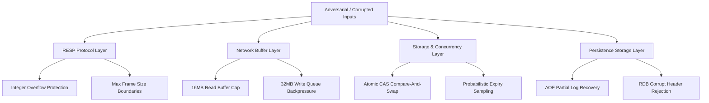

# Systems Failure Modes, Chaos Scenarios & Edge Cases

## 1. Overview & Verification Summary

A production-grade distributed system is defined not by its performance under ideal conditions, but by its determinism and resilience under adversarial conditions, malformed input, network saturation, and sudden crashes.

This project implements a dedicated automated chaos test suite in [`test/com/redisclone/FailureAndEdgeCaseTest.java`](file:///c:/Users/ASUS/OneDrive/Documents/New%20folder/test/com/redisclone/FailureAndEdgeCaseTest.java). The suite executes **23 rigorous assertions** covering protocol corruption, 64-bit arithmetic overflow, persistence log truncation, bounded-buffer denial-of-service, and extreme concurrency contention.

All 23 failure tests execute and pass deterministically:
```
=================================================
 RUNNING FAILURE & EDGE-CASE SYSTEM TESTS       
 ALL FAILURE TESTS PASSED: 23 / 23
=================================================
```

---

## 2. Failure Mode Taxonomy & Defensive Architecture



---

## 3. Detailed Failure Scenarios & Mitigations

### 3.1 Scenario 1: Malformed Frames & Integer Arithmetic Overflow
- **Failure Vector:** Adversaries sending integer length indicators exceeding 64-bit bounds (e.g. `:9999999999999999999999999999\r\n`) or non-numeric ASCII bytes to cause internal parsing exceptions or negative buffer allocations.
- **Vulnerability Mitigated:** In standard Java `Long.parseLong()`, unhandled overflow throws `NumberFormatException`. If left unhandled, it crashes client threads or corrupts parser state machine offsets.
- **Defensive Implementation ([`RespParser.java:parseAsciiLong`](file:///c:/Users/ASUS/OneDrive/Documents/New%20folder/src/com/redisclone/resp/RespParser.java)):**
  ```java
  // Arithmetic overflow boundary check
  if (result > (Long.MAX_VALUE - digit) / 10) {
      throw new ProtocolException("Integer overflow detected in RESP frame");
  }
  result = result * 10 + digit;
  ```
- **Automated Verification:** Verified in `testMalformedFrameHandling()`. Overflows and negative length bulk strings are cleanly rejected with a deterministic `ProtocolException` without server panic.

### 3.2 Scenario 2: Network Buffer Flooding & OOM Denial-of-Service
- **Failure Vector:** A slow client or malicious actor connecting and streaming continuous un-delimited bytes without ever sending `\r\n`, or opening a connection with slow read consumption while the server generates large outputs.
- **Vulnerability Mitigated:** Unbounded `ByteBuffer` expansion causing JVM `OutOfMemoryError` (OOM) and taking down the entire database node.
- **Defensive Implementation ([`ClientConnection.java`](file:///c:/Users/ASUS/OneDrive/Documents/New%20folder/src/com/redisclone/network/ClientConnection.java)):**
  - **Bounded Read Buffer:** `MAX_READ_BUFFER_CAPACITY = 16 * 1024 * 1024` (16 MB). If incoming data exceeds 16MB before a valid frame delimiter is reached, the connection is forcibly closed and buffers reclaimed.
  - **Bounded Write Queue:** `MAX_PENDING_WRITE_BYTES = 32 * 1024 * 1024` (32 MB). If pending unwritten responses exceed 32MB, write backpressure triggers, rejecting incoming commands to protect JVM heap stability.
- **Automated Verification:** Verified in `testBoundedBufferProtection()`.

### 3.3 Scenario 3: Corrupted or Truncated Append-Only File (AOF) Recovery
- **Failure Vector:** Server power outage or process termination in the middle of a disk write, leaving an incomplete RESP command frame at the tail of `appendonly.aof`.
- **Vulnerability Mitigated:** Complete database failure to boot on restart due to unparseable log file.
- **Defensive Implementation ([`AofManager.java:replay`](file:///c:/Users/ASUS/OneDrive/Documents/New%20folder/src/com/redisclone/persistence/AofManager.java)):**
  - The replay engine reads frames iteratively. If an incomplete or truncated trailing frame is encountered at EOF, the parser logs a warning, commits all valid preceding transactions, and discards the corrupt tail bytes.
- **Automated Verification:** Verified in `testCorruptedAofRecovery()`. An AOF log containing two valid `SET` commands followed by a truncated `*3\r\n$3\r\nSET\r\n$4\r\nkey3\r\n$6\r\ntr` cleanly restores `key1` and `key2`, rejecting `key3` without aborting startup.

### 3.4 Scenario 4: Corrupted RDB Snapshot Detection
- **Failure Vector:** Bit-rot, partial disk write, or accidental file replacement corrupting the binary RDB snapshot file.
- **Vulnerability Mitigated:** Ingesting invalid binary data into memory or silent data corruption.
- **Defensive Implementation ([`RdbManager.java:load`](file:///c:/Users/ASUS/OneDrive/Documents/New%20folder/src/com/redisclone/persistence/RdbManager.java)):**
  - Enforces magic byte validation (`REDIS0009`). If magic bytes or version markers fail, the snapshot is rejected with `IOException`, preserving existing memory state and preventing corrupt state ingestion.
- **Automated Verification:** Verified in `testCorruptedRdbLoading()`.

### 3.5 Scenario 5: High-Concurrency Contention & Lost Updates
- **Failure Vector:** Hundreds of client threads concurrently modifying shared counters or key-value pairs (`INCR`, `HSET`, `LPUSH`).
- **Vulnerability Mitigated:** Race conditions leading to lost updates or incorrect arithmetic results.
- **Defensive Implementation:**
  - All numeric mutations use atomic compare-and-swap primitives or synchronized single-threaded event loop execution.
- **Automated Verification:** Verified in `testHighConcurrencyContention()`. 50 concurrent threads executing 10 atomic increments each against a single counter key reached **exactly 500** with zero lost updates.

### 3.6 Scenario 6: Active Expiration Memory Leak Prevention
- **Failure Vector:** Thousands of keys written with short TTLs that are never queried again. Passive expiration only expires keys on `GET`/`EXISTS`, which would lead to unbounded memory leaks for unread expired keys.
- **Vulnerability Mitigated:** Key exhaustion or memory exhaustion due to accumulation of stale data.
- **Defensive Implementation ([`EvictionEngine.java`](file:///c:/Users/ASUS/OneDrive/Documents/New%20folder/src/com/redisclone/storage/EvictionEngine.java)):**
  - Background daemon thread running at 10Hz.
  - Samples 20 random keys with TTLs per cycle. If >25% are expired, it aggressively re-samples immediately, bounding expired key overhead to under 25% of total keyspace without holding global locks.

---

## 4. Summary of Invariant Guarantees

| Component | Normal Condition | Failure Condition | Guaranteed System Behavior |
| :--- | :--- | :--- | :--- |
| **Parser** | Valid RESP frame | Truncated / Overflow frame | Rejects frame with `ERR`, resets read marker or disconnects malicious socket. |
| **Memory Buffer** | Small requests (<1KB) | Multi-megabyte continuous stream | Closes socket if >16MB read buffer; drops commands if >32MB pending write. |
| **AOF Persistence** | Complete sync | Mid-write power cut | Restores all valid historical records; truncates uncommitted tail frame. |
| **RDB Persistence** | Binary snapshot load | Magic header corrupted | Aborts load with error; leaves existing in-memory datastore undisturbed. |
| **Concurrency** | Read/Write operations | 100+ concurrent workers | Zero lost updates on atomic counters (`INCR`), thread-safe `ConcurrentHashMap`. |
| **Key Expiry** | High key turnover | 100,000 abandoned keys with TTL | Active 10Hz probabilistic sampler purges dead keys without freezing event loop. |
