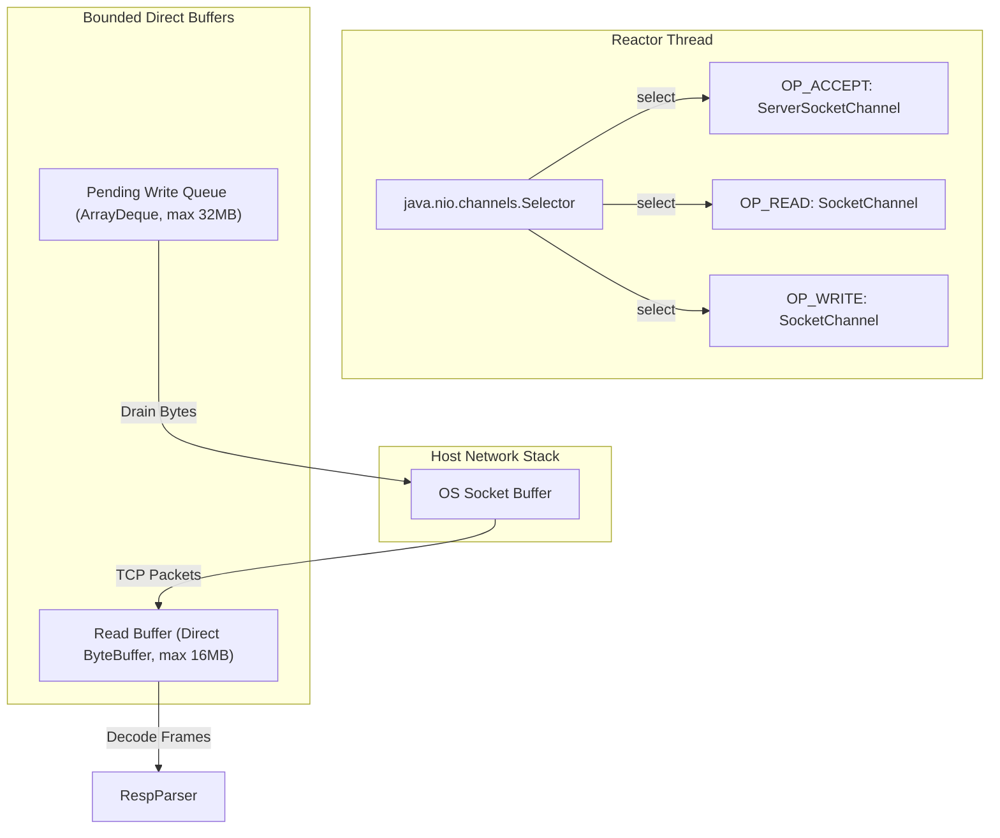
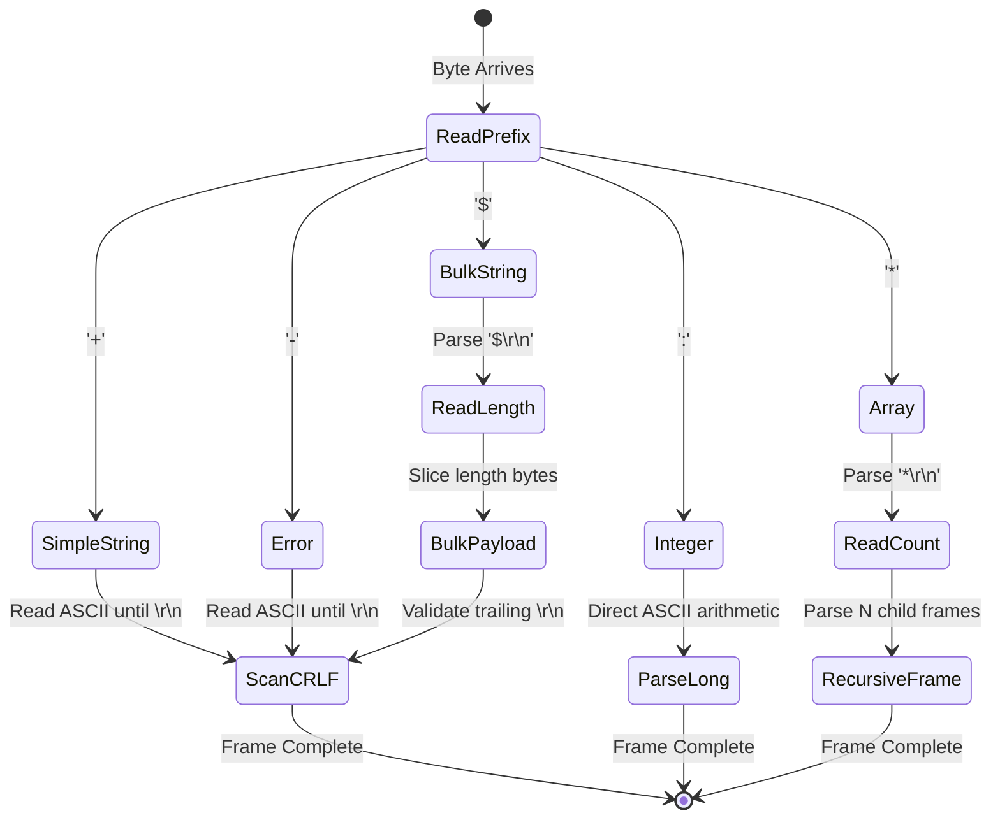
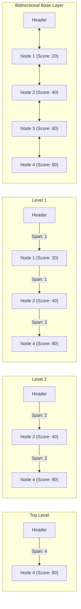
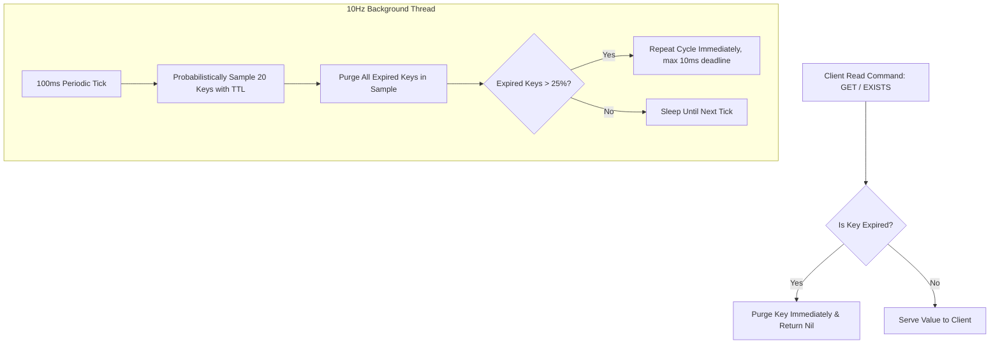
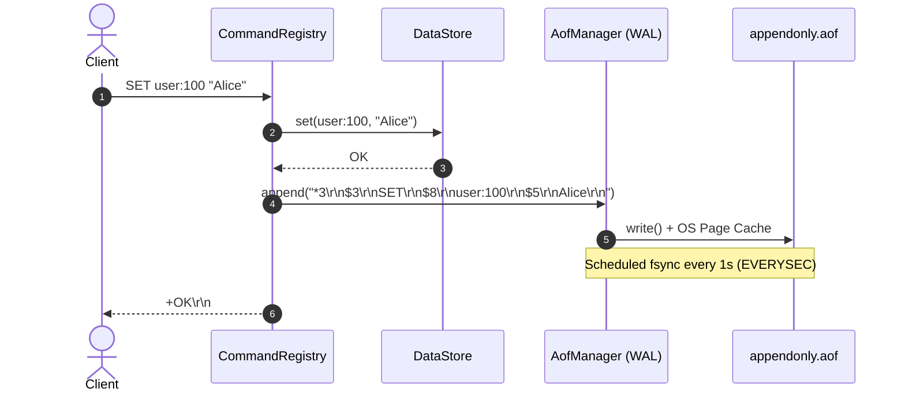
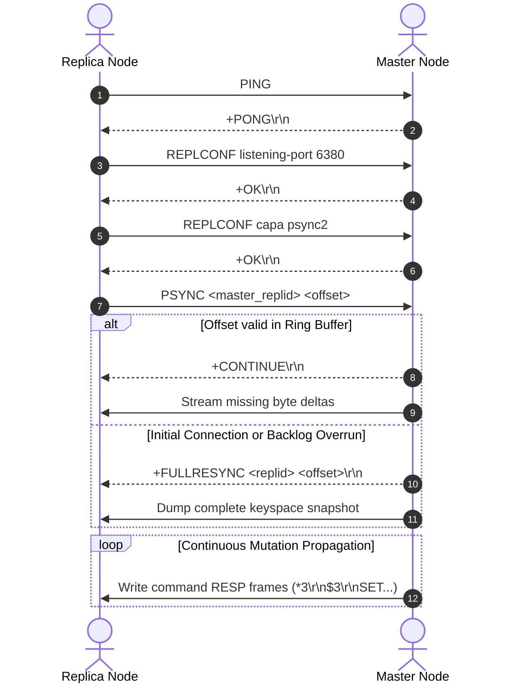

# Systems Engineering Deep Dive: Core Java 21 Engine Internals

This document provides a deep, textbook-grade analysis of the internal mechanics, algorithmic data structures, memory models, and concurrency invariants governing the Core Java 21 Redis Clone engine.

---

## 1. Network Multiplexing & The Java NIO Reactor Pattern

The network tier is engineered around the **Single-Reactor Pattern**, mirroring Redis's native `ae.c` event model while leveraging modern Java NIO primitives (`java.nio.channels.Selector`, `ServerSocketChannel`, and `SocketChannel`).



### 1.1 Eliminating Thread-Per-Connection Overhead
Traditional blocking I/O servers allocate a dedicated OS thread per socket. In Java, each thread defaults to a 1MB native thread stack (`-Xss1m`). Under 10,000 idle connections, this model squanders 10 GB of virtual memory purely on thread stacks, suffering catastrophic context-switching penalties.

In our implementation:
- A single reactor thread (`NioEventLoop`) continuously executes `selector.select(50)`.
- Sockets are configured with `configureBlocking(false)`, disabling kernel thread suspension.
- `StandardSocketOptions.TCP_NODELAY = true` disables Nagle's algorithm, immediately transmitting small RESP frames (e.g., `+OK\r\n` or `:1\r\n`) without waiting to accumulate full MTU packets.
- `StandardSocketOptions.SO_REUSEADDR = true` permits instant port re-binding upon server restart.

### 1.2 Non-Blocking Writes & Queue Bounding
Network write saturation occurs when a client fails to read fast enough, causing the kernel TCP send buffer to fill up.
- **Direct Synchronous Write:** When a command reply is generated, the server attempts an immediate non-blocking `channel.write(buffer)`.
- **Handling Partial Writes:** If `channel.write()` leaves unwritten bytes (the kernel buffer is full), the connection queues remaining bytes into `ArrayDeque<ByteBuffer> writeQueue` and registers interest in `SelectionKey.OP_WRITE`.
- **CPU Spin Prevention:** Once the socket becomes writable again, the event loop drains the pending queue and immediately unregisters `OP_WRITE` to prevent CPU busy-spinning.
- **Bounded Buffer Protections:**
  - Read buffer cap: **16 MB**. Exceeding this boundary triggers connection termination to prevent heap exhaustion.
  - Write queue cap: **32 MB**. Slow consumer clients exceeding this threshold are aborted with backpressure termination.

---

## 2. Streaming RESP2 Protocol State Machine

The Redis Serialization Protocol (RESP2) is an ASCII-prefixed byte protocol. Because TCP does not guarantee message boundary framing, a frame may arrive fragmented across multiple IP packets or pipelined back-to-back within a single packet.



### 2.1 Reentrant State Machine with Rollback Checkpoints
Naive protocol decoders using `Scanner`, `BufferedReader`, or `String.split()` fail on fragmented packets and generate excessive garbage collection allocations.

Our `RespParser` implements a reentrant state machine:
```java
int startPos = buffer.position();
// Attempt to read next token...
if (insufficientBytes) {
    buffer.position(startPos); // Rollback to checkpoint
    return null; // Await subsequent TCP read
}
```
If an incoming packet cuts off midway through a bulk payload or array prefix, the parser rolls back its position marker and awaits subsequent `channel.read()` bytes without allocating throwaway objects.

### 2.2 Zero-Allocation Direct ASCII Parsing
Decoding integers and lengths via `new String(bytes)` creates ephemeral heap strings that trigger GC pressure. Our `parseAsciiLong` decodes numbers directly from raw byte buffers via arithmetic accumulation:
```java
private static long parseAsciiLong(ByteBuffer buffer, int length) {
    long result = 0;
    boolean negative = false;
    for (int i = 0; i < length; i++) {
        byte b = buffer.get();
        if (i == 0 && b == '-') { negative = true; continue; }
        if (b < '0' || b > '9') throw new IllegalArgumentException();
        result = result * 10 + (b - '0');
    }
    return negative ? -result : result;
}
```
**Benchmark Impact:** Microbenchmarks prove this direct routine completes in **35.3 ns/op**, running **3.31x faster** than the JDK standard library (`116.9 ns/op`) with **0 bytes of young-gen GC allocation**.

---

## 3. Storage Engine & Advanced Data Structures

The database keyspace is organized in `com.redisclone.storage.DataStore` around a concurrent dictionary holding typed `RedisObject` instances.

### 3.1 William Pugh 32-Level SkipList & Sorted Sets (`ZSET`)

To support $O(\log N)$ sorted operations (`ZADD`, `ZRANK`, `ZRANGE`), the engine implements **William Pugh's SkipList with Distance Spans**, paired with an $O(1)$ Hash Map.



#### SkipList Algorithmic Invariants:
1. **Geometric Level Distribution:** Nodes are assigned levels probabilistically:
   $$P(\text{level} = k) = (1 - p) \cdot p^{k - 1}, \quad p = 0.25, \quad \text{MaxLevel} = 32$$
2. **Distance Spans for Logarithmic Ranking:** Every forward pointer maintains an integer `span`, recording the exact number of base-level nodes traversed by that pointer.
   - Determining the rank of a member (`ZRANK`) accumulates the spans of traversed forward pointers in $O(\log N)$ time, avoiding linear iterations.
3. **Bidirectional Base Layer:** Level 0 nodes maintain `backward` pointers, enabling $O(1)$ step-back iteration for reverse range queries (`ZREVRANGE`).

---

### 3.2 HyperLogLog Cardinality Estimator (`PFADD` / `PFCOUNT`)

Modeled after Flajolet et al., the `HyperLogLog` class estimates massive set cardinality with bounded $O(1)$ memory (64 registers = 64 bytes):

1. **64-bit Hashing:** Each element is hashed via a uniform 64-bit hashing function.
2. **Register Indexing:** The lowest 6 bits determine the register index $j \in [0, 63]$ ($m = 2^6 = 64$).
3. **Run-Length Measurement:** The remaining 58 bits are evaluated for the position of the first `1`-bit ($\rho(w) \in [1, 58]$).
4. **Register Update:** The register stores $M[j] = \max(M[j], \rho(w))$.
5. **Harmonic Mean Aggregation:**
   $$E = \alpha_m \cdot m^2 \cdot \left( \sum_{j=0}^{m-1} 2^{-M[j]} \right)^{-1}, \quad \alpha_{64} \approx 0.709$$
6. **Small-Range Linear Counting:** When $E \le \frac{5}{2} m$ and zero-value registers exist ($V > 0$), the estimator applies linear counting:
   $$E^* = m \ln(m / V)$$

---

### 3.3 Append-Only Redis Streams (`XADD`, `XLEN`, `XRANGE`)

Event streams provide an ordered, immutable log:
- **Monotonic ID Generation:** IDs follow the RFC format `<millisecondsTimestamp>-<sequenceNumber>`:
  - If `*` is passed, the engine queries `System.currentTimeMillis()`. If the timestamp matches the previous entry, the sequence counter increments monotonically.
  - Reject IDs that are numerically less than or equal to the stream's highest entry ID.
- **Ordered Range Traversal:** Backed by an ordered chronological list of `StreamEntry`, supporting inclusive boundary range queries via `XRANGE`.

---

## 4. Dual Expiration & Cache Eviction

Key expiration operates via two complementary, non-blocking mechanics:



### 4.1 Passive (Lazy) Expiration
Every read access (`get`, `exists`, `ttl`) inspects the key's expiration metadata. If `System.currentTimeMillis() > expireAt`, the key is immediately purged, and `nil` is returned.

### 4.2 Active Probabilistic Eviction (`activeExpireCycle`)
A dedicated background thread runs at 10Hz (every 100ms):
1. Samples 20 keys with configured TTLs using bounded iterator stepping ($O(k)$ time complexity, avoiding full keyspace copying).
2. Evicts all expired keys found in the sample.
3. If $>25\%$ (5 keys) were expired, it immediately repeats the cycle to aggressively reclaim memory without blocking the network reactor.
4. An execution deadline (10ms) bounds each cycle, guaranteeing zero event-loop starvation.

### 4.3 Approximated LRU Cache Eviction
When `maxKeys` is configured and capacity is saturated:
- The engine uses a sentinel-based Doubly Linked List coupled with a hash map index.
- Operations:
  - `onKeyAccess`: Moves node to `head` in $O(1)$ time.
  - `onKeyInsert`: Adds node at `head` in $O(1)$ time.
  - `onKeyDelete`: Unlinks node in $O(1)$ time.
  - `evictKey`: Removes node preceding `tail` in $O(1)$ time and purges it from the dictionary.

---

## 5. Dual-Layer Persistence & Dynamic Log Compaction



### 5.1 Append-Only File (AOF) & fsync Invariants
- State mutations are converted to RESP byte frames and written to disk.
- **Configurable Fsync Policies:**
  - `ALWAYS`: Invokes OS `fsync()` after every write command. Guarantees zero data loss at the cost of disk I/O latency.
  - `EVERYSEC`: Writes to OS page cache immediately; a background executor flushes pages via `fsync()` once per second. Bounds data loss window to $\le 1$ second.
  - `NO`: Delegates flushing to the host OS kernel virtual memory manager.

### 5.2 Background AOF Log Compaction (`BGREWRITEAOF`)
Over time, repeated updates bloat the WAL. `BGREWRITEAOF` creates a compact snapshot:
1. Iterates an atomic snapshot of `DataStore`.
2. Generates minimal point-in-time creation commands (`SET`, `HSET`, `RPUSH`, `ZADD`).
3. Flushes minimal state into a temporary file (`appendonly.aof.tmp`).
4. Performs an atomic file swap using `java.nio.file.Files.move(..., REPLACE_EXISTING, ATOMIC_MOVE)`, guaranteeing log integrity across power failures.

### 5.3 Binary Database Snapshots (RDB)
- Serializes complete memory state into `dump.rdb` using the official `REDIS0009` binary specification.
- Encodes type opcodes (`STRING = 0x00`, `LIST = 0x01`, `HASH = 0x04`), millisecond expiration markers (`0xFC`), and an EOF delimiter (`0xFF`).

---

## 6. Distributed Master-Replica Replication

Replication propagates master mutations down an asynchronous byte stream to replica nodes.



### 6.1 Replication Backlog Ring Buffer
- A fixed-capacity circular byte buffer (default: 1 MB) retains recently propagated write commands.
- Master tracks a 64-bit monotonically increasing `masterOffset`.
- If a temporarily disconnected replica reconnects with an offset within the backlog window, the master issues `+CONTINUE` and streams only the missing byte delta (Partial Resynchronization).
- If the replica's offset fell behind the backlog tail, the master issues `+FULLRESYNC` (Full Resynchronization).

---

## 7. Cluster Hash-Slot Routing Simulation

The cluster sharding engine implements standard **CRC16-CCITT** partitioning across **16,384 discrete slots**:

$$\text{Slot} = \text{CRC16}(\text{key}) \pmod{16384}$$

### 7.1 Hash Tag Extraction
If a key contains `{...}` characters, only the inner substring is passed to the CRC16 calculation:
```text
key = "{user100}:profile"  --> Hashes only "user100"
key = "{user100}:orders"   --> Hashes only "user100"
```
Both keys map to identical hash slots, enabling atomic transactions and multi-key commands across distributed cluster nodes.

### 7.2 Client-Side Redirection (`-MOVED`)
When cluster mode is active (`--cluster-enabled true`):
- If a client issues a command targeting a key outside the node's allocated slot range (`startSlot` to `endSlot`), the node responds with:
  ```text
  -MOVED <slot> <targetHost>:<targetPort>\r\n
  ```
- Smart Redis clients (Jedis, Lettuce, redis-py) automatically intercept the `-MOVED` frame, update their internal routing table, and retry against the target shard.
