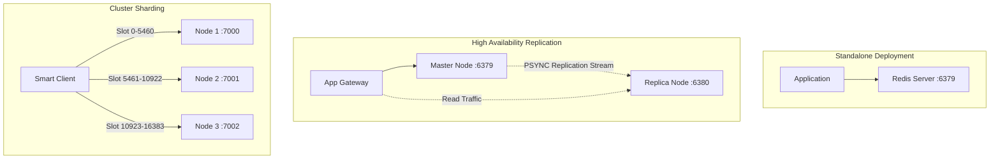

# Production Operations, Configuration & Deployment Manual

This manual provides instructions for deploying, configuring, tuning, and operating the Core Java 21 Redis Clone engine in mission-critical and production environments.

---

## 1. Server Configuration Reference

The server engine is configured via runtime CLI parameters or programmatic instantiation of `com.redisclone.server.ServerConfig`.

### 1.1 CLI Configuration Flags

| Parameter | Type | Default Value | Description |
| :--- | :--- | :--- | :--- |
| `--port <int>` | Integer | `6379` | TCP port on which the Java NIO reactor event loop listens. |
| `--host <string>` | String | `0.0.0.0` | Network interface IP binding (`0.0.0.0` binds all interfaces, `127.0.0.1` binds loopback). |
| `--replicaof <host> <port>` | Tuple | `null` | Configures the instance as a read-only replica of a master Redis node. |
| `--maxkeys <int>` | Integer | `0` (unlimited) | Maximum keyspace capacity. Saturated capacity triggers the active eviction policy. |
| `--cluster-enabled <bool>`| Boolean| `false` | Enables CRC16 hash-slot cluster sharding simulation and `-MOVED` redirection. |
| `--aof <bool>` | Boolean | `true` | Enables Append-Only File (WAL) persistence stream to `appendonly.aof`. |
| `--rdb <bool>` | Boolean | `true` | Enables binary point-in-time memory snapshotting to `dump.rdb`. |

### 1.2 Programmatic Configuration (`ServerConfig.java`)

```java
import com.redisclone.server.ServerConfig;
import com.redisclone.server.RedisServer;
import com.redisclone.persistence.AofManager.FsyncPolicy;
import com.redisclone.storage.eviction.LruEvictionPolicy;

ServerConfig config = new ServerConfig();
config.setHost("127.0.0.1");
config.setPort(6379);

// Persistence configuration
config.setAofEnabled(true);
config.setAofFilePath("data/appendonly.aof");
config.setAofFsync(FsyncPolicy.EVERYSEC); // ALWAYS, EVERYSEC, NO
config.setRdbEnabled(true);
config.setRdbFilePath("data/dump.rdb");

// Memory and Eviction limits
config.setMaxKeys(500_000);
config.setEvictionPolicy(LruEvictionPolicy.allKeysLru()); // or NoEvictionPolicy

// Cluster simulation
config.setClusterEnabled(false);
config.setClusterStartSlot(0);
config.setClusterEndSlot(16383);

RedisServer server = new RedisServer(config);
server.start();
```

---

## 2. Java 21 Runtime Tuning & JVM Ergonomics

Because the engine utilizes direct non-blocking NIO byte buffers and memory-sensitive data structures, tuning JVM parameters unlocks maximum performance.

### 2.1 Recommended Production Startup Flags

```bash
java \
  -server \
  -Xms4g \
  -Xmx4g \
  -XX:+UseZGC \
  -XX:+ZGenerational \
  -XX:MaxDirectMemorySize=2g \
  -XX:+AlwaysPreTouch \
  -XX:+TieredCompilation \
  -Djava.net.preferIPv4Stack=true \
  -cp bin com.redisclone.server.RedisServer --port 6379
```

### 2.2 JVM Parameter Breakdown

1. **`-XX:+UseZGC -XX:+ZGenerational` (Java 21 Generational ZGC):**
   - **Why:** In-memory databases are vulnerable to stop-the-world (STW) GC pauses. Java 21's Generational ZGC maintains sub-millisecond GC pause times (< 1ms) even across multi-gigabyte heaps, preventing reactor thread latency spikes.
2. **`-Xms4g -Xmx4g`:**
   - Pre-allocates heap memory upon startup, preventing JVM heap expansion pauses during high-throughput ingestion spikes.
3. **`-XX:MaxDirectMemorySize=2g`:**
   - The engine relies on Java NIO direct byte buffers (`ByteBuffer.allocateDirect`) for zero-copy OS socket transmission. Direct memory bypasses the Java garbage collection heap and talks directly to OS virtual memory pages.
4. **`-XX:+AlwaysPreTouch`:**
   - Pre-touches all memory pages during process initialization, preventing page-fault latency penalties during initial request bursts.

---

## 3. Host Operating System & Kernel Optimization

For high-concurrency production deployments (serving >20,000 requests/second), apply the following Linux kernel sysctl configurations.

### 3.1 Kernel Parameters (`/etc/sysctl.conf`)

```ini
# Maximum socket listen backlog (prevents connection drops during high connection surges)
net.core.somaxconn = 65535

# Maximum pending socket connections in the embryonic SYN queue
net.ipv4.tcp_max_syn_backlog = 65535

# Linux memory overcommit (required to support background RDB/AOF writes without OOM errors)
vm.overcommit_memory = 1

# TCP FIN timeout (faster socket recycling under high ephemeral connection churn)
net.ipv4.tcp_fin_timeout = 15

# Enable TCP window scaling
net.ipv4.tcp_window_scaling = 1

# Increase local port range
net.ipv4.ip_local_port_range = 1024 65535
```

Apply immediately using:
```bash
sudo sysctl -p
```

### 3.2 File Descriptor Limits (`/etc/security/limits.conf`)

Non-blocking network reactors require open file descriptors for each active client socket:

```text
redisuser soft nofile 65536
redisuser hard nofile 65536
```

---

## 4. Deployment Topologies



### 4.1 Topology 1: Standalone Instance
Standard setup for development, caching, or single-node operational caches.
```bash
java -cp bin com.redisclone.server.RedisServer --port 6379 --aof true --rdb true
```

### 4.2 Topology 2: Master-Replica High Availability Pair
Separates write and read workloads. Mutations on the master stream asynchronously to the replica.
```bash
# Terminal 1: Master Node
java -cp bin com.redisclone.server.RedisServer --port 6379 --aof true

# Terminal 2: Replica Node
java -cp bin com.redisclone.server.RedisServer --port 6380 --replicaof 127.0.0.1 6379 --aof false
```

### 4.3 Topology 3: Docker Compose Multi-Node Cluster
Deploy a multi-node master-replica topology with automatic network isolation:

```bash
docker-compose up -d
```

Verify running containers:
```bash
docker-compose ps
```

---

## 5. Telemetry, Observability & Health Checks

The engine exposes detailed real-time telemetry through the standard `INFO` command.

### 5.1 Parsing `INFO` Output

Execute via CLI:
```bash
redis-cli -p 6379 INFO
```

Output format:
```text
# Server
redis_version:7.0.0-systems-clone
os:Windows 11
process_id:12844
tcp_port:6379
uptime_in_seconds:3600

# Memory
used_memory:1048576
used_memory_human:1024K
jvm_heap_used:45097152
jvm_heap_total:268435456
maxmemory_policy:allkeys-lru

# Stats
total_connections_received:142
total_commands_processed:254300
total_command_errors:0
keyspace_hits:189420
keyspace_misses:12030
keyspace_hit_ratio:0.9403
expired_keys:450
evicted_keys:0
total_net_input_bytes:12894002
total_net_output_bytes:24901230

# Replication
role:master
connected_slaves:1
master_replid:a1b2c3d4e5f6...
master_repl_offset:145092

# Cluster
cluster_enabled:0

# Keyspace
db0:keys=15000
```

### 5.2 Key Observability Metrics for Alerting

| Metric Name | Warning Threshold | Critical Action / Diagnosis |
| :--- | :--- | :--- |
| `keyspace_hit_ratio` | `< 0.85` | Cache efficiency degradation. Inspect TTL durations or increase keyspace capacity. |
| `evicted_keys` | Rapidly increasing | Memory limit (`maxkeys`) reached. The engine is evicting LRU items to accommodate new writes. |
| `total_command_errors` | `> 0` | Malformed client RESP framing or unsupported command payloads. |
| `connected_slaves` | Drop to `0` on master | Replica disconnect. Investigate network partitioning between master and replica hosts. |
| `jvm_heap_used` | `> 85%` of total heap | Heap saturation. Allocate larger `-Xmx` or tune `--maxkeys`. |

---

## 6. Operational Runbooks & Disaster Recovery

### Runbook 1: Performing Online AOF Log Compaction (`BGREWRITEAOF`)
Over time, frequent mutations cause the `appendonly.aof` file to grow with obsolete write history.
1. Issue the rewrite command:
   ```bash
   redis-cli -p 6379 BGREWRITEAOF
   ```
2. The server creates `appendonly.aof.tmp`, writes minimal point-in-time commands (`SET`, `HSET`, `RPUSH`, `ZADD`), flushes disk pages, and atomically swaps the log file via `java.nio.file.Files.move(..., REPLACE_EXISTING)`.

### Runbook 2: On-Demand Binary Snapshotting (`SAVE` / `BGSAVE`)
To create an instantaneous state backup before server migration or maintenance:
```bash
redis-cli -p 6379 BGSAVE
```
This writes all active key-value entries to `dump.rdb` without blocking concurrent client requests.

### Runbook 3: Disaster Recovery from Disk
If a host crashes or terminates unexpectedly:
1. Verify presence of `appendonly.aof` and `dump.rdb` in the working directory.
2. The server recovery order prioritizes **AOF over RDB**:
   - If `appendonly.aof` exists and is non-empty, the recovery engine parses all historical RESP commands.
   - If the last transaction in AOF was truncated due to a power outage, the streaming parser commits all preceding valid operations and logs a non-fatal warning.
   - If AOF is absent, the engine hydrates state directly from the binary `dump.rdb` snapshot.
3. Start the node:
   ```bash
   java -cp bin com.redisclone.server.RedisServer --port 6379
   ```

### Runbook 4: Promoting a Replica to Master
If the primary master node suffers a hardware failure:
1. Connect to the healthy replica:
   ```bash
   redis-cli -p 6380
   ```
2. Issue the promotion command:
   ```text
   127.0.0.1:6380> REPLICAOF NO ONE
   OK
   ```
3. The replica transitions from read-only mode to full master mode, accepting read and write mutations.
