# Core Java 21 Redis Clone: Technical Documentation Hub

Welcome to the definitive documentation hub for the **Core Java 21 Redis Clone**—a high-performance, zero-dependency in-memory key-value database, distributed cache, and event streaming engine.

---

## 🗺️ Reading Pathways by Role

Select the pathway tailored to your engineering objectives:

```mermaid
graph TD
    Start([Choose Your Role]) --> PathDev[Application Developer]
    Start --> PathSRE[DevOps / SRE / Operator]
    Start --> PathArch[Systems Architect]
    Start --> PathEng[Core Engine Contributor]
    Start --> PathAcad[Academic / Interview Prep]

    PathDev --> DocClient["Client Integration Guide<br>docs/CLIENT_INTEGRATION_GUIDE.md"]
    PathDev --> DocCmd["Command Reference (47 Commands)<br>docs/COMMAND_REFERENCE.md"]

    PathSRE --> DocOps["Operations & Config Guide<br>docs/OPERATIONS_AND_CONFIGURATION_GUIDE.md"]
    PathSRE --> DocFail["Failure Modes & Chaos<br>docs/FAILURE_MODES.md"]

    PathArch --> DocArch["Architecture Specification<br>docs/ARCHITECTURE.md"]
    PathArch --> DocDeep["Internals Deep Dive<br>docs/INTERNALS_DEEP_DIVE.md"]
    PathArch --> DocADR["Architecture Decision Records<br>docs/DESIGN_DECISIONS.md"]
    PathArch --> DocLab["Interactive Architecture Lab<br>docs/interactive-architecture.html"]

    PathEng --> DocContrib["Contributor Guide<br>docs/DEVELOPER_CONTRIBUTING_GUIDE.md"]
    PathEng --> DocAudit["Engineering Code Audit<br>docs/ENGINEERING_AUDIT.md"]
    PathEng --> DocChaos["Brutal Testing & Invariants<br>docs/BRUTAL_TESTING_AND_VERIFICATION.md"]

    PathAcad --> DocReport["Systems Report<br>docs/SYSTEMS_REPORT.md"]
    PathAcad --> DocQ["50+ Interview Questions<br>docs/INTERVIEW_QUESTIONS.md"]
    PathAcad --> DocPort["Portfolio & SOP Summary<br>docs/PORTFOLIO_SUMMARY.md"]
```

---

## 📚 Complete Technical Document Catalog

### 1. Developer & Client Integration
- [`docs/COMMAND_REFERENCE.md`](file:///c:/Users/ASUS/OneDrive/Documents/New%20folder/docs/COMMAND_REFERENCE.md)
  **47-Command Reference Manual:** Complete syntax, arguments, $O(\log N)$ / $O(1)$ algorithmic complexity, RESP wire return types, and copy-pasteable examples for Strings, Hashes, Lists, SkipList Sorted Sets, Bitmaps, HyperLogLog, Streams, Transactions, Pub/Sub, Replication, and Cluster commands.
- [`docs/CLIENT_INTEGRATION_GUIDE.md`](file:///c:/Users/ASUS/OneDrive/Documents/New%20folder/docs/CLIENT_INTEGRATION_GUIDE.md)
  **Client SDK Integration Guide:** Complete connection guides and code examples for Java (Jedis & Lettuce), Python (`redis-py` & async), Node.js (`ioredis`), Go (`go-redis`), and raw zero-dependency TCP sockets. Includes real-world patterns for distributed rate limiting and prompt caching.
- [`docs/DEVELOPER_CONTRIBUTING_GUIDE.md`](file:///c:/Users/ASUS/OneDrive/Documents/New%20folder/docs/DEVELOPER_CONTRIBUTING_GUIDE.md)
  **Contributor & Extensibility Guide:** Step-by-step tutorial on implementing new Redis commands, local workspace setup, 172-assertion test execution, and microbenchmarking.

---

### 2. Operations, Deployment & Configuration
- [`docs/OPERATIONS_AND_CONFIGURATION_GUIDE.md`](file:///c:/Users/ASUS/OneDrive/Documents/New%20folder/docs/OPERATIONS_AND_CONFIGURATION_GUIDE.md)
  **Production Operations Manual:** Configuration flags (`--port`, `--maxkeys`, `--aof`, `--rdb`, `--replicaof`, `--cluster-enabled`), Java 21 Generational ZGC runtime tuning, host OS sysctl optimizations (`somaxconn`, `overcommit_memory`), multi-node deployment topologies, `INFO` telemetry parsing, and disaster recovery runbooks.
- [`docs/SECURITY.md`](file:///c:/Users/ASUS/OneDrive/Documents/New%20folder/docs/SECURITY.md)
  **Security & Hardening Specification:** Threat model analysis, bounded buffer limits (16MB read / 32MB write), protocol injection defense, and network isolation guidelines.

---

### 3. Architecture & Low-Level Systems Mechanics
- [`docs/ARCHITECTURE.md`](file:///c:/Users/ASUS/OneDrive/Documents/New%20folder/docs/ARCHITECTURE.md)
  **High-Level Systems Design:** End-to-end architecture breakdown, Mermaid sequence diagrams, memory layouts, and subsystem interactions.
- [`docs/INTERNALS_DEEP_DIVE.md`](file:///c:/Users/ASUS/OneDrive/Documents/New%20folder/docs/INTERNALS_DEEP_DIVE.md)
  **Systems Engineering Deep Dive:** Detailed mathematical and algorithmic breakdown of the Java NIO Reactor, reentrant RESP state machine, 32-level William Pugh SkipList with distance spans, 64-register Flajolet HyperLogLog, append-only streams, 10Hz active eviction daemon, circular replication backlog, and dual persistence.
- [`docs/DESIGN_DECISIONS.md`](file:///c:/Users/ASUS/OneDrive/Documents/New%20folder/docs/DESIGN_DECISIONS.md)
  **Architectural Decision Records (ADR 001 - ADR 005):** Design rationale, alternatives considered, and tradeoffs for Single Reactor vs Worker Pool, Custom RESP Parser vs Netty, William Pugh SkipList vs Red-Black Trees, AOF Compaction via Atomic Swaps, and Linear Counting in HyperLogLog.
- [`docs/interactive-architecture.html`](file:///c:/Users/ASUS/OneDrive/Documents/New%20folder/docs/interactive-architecture.html)
  **Interactive Diagnostic Workbench:** Live browser-based visualization of the NIO reactor, SkipList node spans, 16,384-slot CRC16 ring, replication backlog ring buffer, and active eviction cycles.

---

### 4. Verification, Chaos Engineering & Resiliency
- [`docs/BRUTAL_TESTING_AND_VERIFICATION.md`](file:///c:/Users/ASUS/OneDrive/Documents/New%20folder/docs/BRUTAL_TESTING_AND_VERIFICATION.md)
  **Formal Invariants & Adversarial Torture:** Byte-level TCP packet fragmentation fuzzing, 100-thread CAS race torture, SkipList rank invariant proofs (2,000 operations), glob pattern pub/sub fuzzing, and active TTL expiration saturation.
- [`docs/FAILURE_MODES.md`](file:///c:/Users/ASUS/OneDrive/Documents/New%20folder/docs/FAILURE_MODES.md)
  **Chaos Test Suite & Failure Modes:** Corrupted AOF recovery, invalid RDB header rejection, 64-bit integer overflow, and buffer flood limits.
- [`docs/ENGINEERING_AUDIT.md`](file:///c:/Users/ASUS/OneDrive/Documents/New%20folder/docs/ENGINEERING_AUDIT.md)
  **Comprehensive Codebase Audit:** Invariant proofs, structural refactoring logs, and formal correctness assertions across all 47 commands.

---

### 5. Empirical Performance & Real-World Impact
- [`docs/BENCHMARKING.md`](file:///c:/Users/ASUS/OneDrive/Documents/New%20folder/docs/BENCHMARKING.md)
  **Nanosecond Systems Benchmarking:** Concurrency scaling (1 to 100 clients), pipelining depth sweeps (1 to 64 depth), latency histograms, and OpenJDK 21 Tier 4 C2 microbenchmarks.
- [`docs/REAL_WORLD_IMPACT.md`](file:///c:/Users/ASUS/OneDrive/Documents/New%20folder/docs/REAL_WORLD_IMPACT.md)
  **Semantic Prompt Cache Evaluation:** Experimental validation serving AI inference gateways, demonstrating a **400.8x speedup** and 91.7% cache hit ratio.

---

### 6. Academic Provenance & Career Artifacts
- [`docs/SYSTEMS_REPORT.md`](file:///c:/Users/ASUS/OneDrive/Documents/New%20folder/docs/SYSTEMS_REPORT.md)
  **Comprehensive Engineering Report:** Architectural analysis, mechanical sympathy review, and systems evaluation.
- [`docs/INTERVIEW_QUESTIONS.md`](file:///c:/Users/ASUS/OneDrive/Documents/New%20folder/docs/INTERVIEW_QUESTIONS.md)
  **50+ Staff-Level Systems Interview Questions:** In-depth technical questions and defenses across NIO multiplexing, memory models, distributed replication, and WAL persistence.
- [`docs/PORTFOLIO_SUMMARY.md`](file:///c:/Users/ASUS/OneDrive/Documents/New%20folder/docs/PORTFOLIO_SUMMARY.md)
  **Academic & Resume Artifacts:** Statement of Purpose blurbs for top graduate programs (Stanford, MIT, CMU) and staff-level engineering resume bullets.
- [`docs/ATTRIBUTION_AND_ORIGIN.md`](file:///c:/Users/ASUS/OneDrive/Documents/New%20folder/docs/ATTRIBUTION_AND_ORIGIN.md)
  **Provenance & Attribution Statement:** Clean-room implementation declaration, academic integrity disclosures, and architectural comparison with official Redis (C) and Netty.
