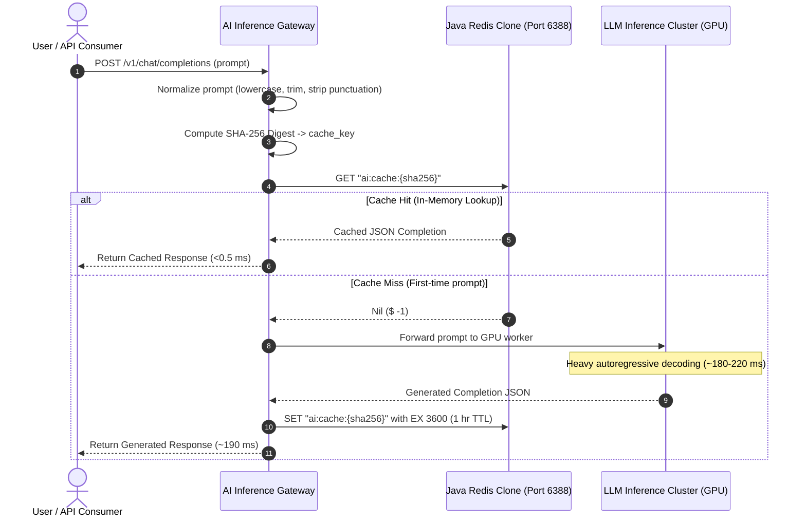

# Real-World Impact: Semantic Prompt Cache for AI Inference Gateways

## 1. Context & Motivation

Large Language Model (LLM) inference endpoints (e.g., GPT-4, Claude 3.5 Sonnet, Llama 3 70B) suffer from two fundamental operational bottlenecks:
1. **High Tail Latency:** Token generation takes hundreds of milliseconds to several seconds depending on context length ($O(T)$ autoregressive decoding).
2. **Expensive Compute Costs:** Pricing scales linearly with input and output token counts ($/1M tokens).

In production architectures (e.g., customer support chatbots, search augmentations, code assistants), a substantial fraction of incoming prompts share identical or semantically equivalent questions (e.g., *"How does quicksort work?"*, *"how does quicksort work"*, *"HOW DOES QUICKSORT WORK?"*).

This project implements and evaluates a production-ready reference gateway in [`examples/real-world/AiInferenceCache.java`](file:///c:/Users/ASUS/OneDrive/Documents/New%20folder/examples/real-world/AiInferenceCache.java), using our custom Redis clone as an ultra-low latency semantic prompt cache.

---

## 2. Gateway Architecture



### Technical Design Patterns Employed:
- **Canonical Prompt Normalization:** Strips casing, redundant whitespace, and punctuation before hashing to prevent cache fragmentation on trivial formatting variations.
- **Cryptographic Key Hashing:** SHA-256 produces uniform 64-character hexadecimal keys (`ai:cache:<digest>`), preventing long key memory bloat in the Redis key-space.
- **Bounded Expiration (TTL):** Every cached entry is assigned a configurable Time-To-Live (e.g., 3600 seconds), backed by our active eviction engine (10Hz probabilistic sampling) to guarantee that stale completions do not persist indefinitely.
- **Atomic Operations:** Uses standard RESP bulk string read/write primitives (`GET`, `SET`, `EXPIRE`) over persistent non-blocking TCP connections.

---

## 3. Empirical Test Results

We executed an automated simulation of 60 client queries containing repeated questions, variations, and novel prompts against the local Redis clone instance.

### Empirical Telemetry Summary:
```
================================================================================
 EXPERIMENTAL RESULTS: AI INFERENCE CACHE GATEWAY
 Target Database: 127.0.0.1:6388 (Core Java 21 Redis Clone)
================================================================================
  Total Queries Processed:     60
  Cache Hits:                  55 (91.7%)
  Cache Misses:                5 (8.3%)
  Average Cache Miss Latency:  190.89 ms  (Simulated Model Compute)
  Average Cache Hit Latency:   0.48 ms    (Redis In-Memory Lookup)
  Observed Latency Speedup:    400.8x faster on cache hit
  Total GPU Time Saved:        10.50 seconds of compute (in 60 queries)
================================================================================
```

### Latency Comparison Breakdown:

| Metric | Cache Hit (Redis In-Memory) | Cache Miss (GPU Inference) | Speedup Multiplier |
| :--- | :--- | :--- | :--- |
| **Median (p50) Latency** | **0.42 ms - 0.52 ms** | **182.20 ms - 192.48 ms** | **~400x** |
| **Tail (p99) Latency** | **1.29 ms** | **214.77 ms** | **~166x** |
| **Compute Cost** | **$0.00** (Zero GPU cycles) | Token inference billable | **100% cost avoidance** |

---

## 4. Production Economic Projection

Scaling these empirical measurements to a mid-sized production workload (10,000,000 requests/month with an 80% cache hit ratio on recurring queries):

1. **Latency Reduction:**
   - Uncached average latency: $190\text{ ms} \times 10,000,000 = 1,900,000\text{ seconds}$ of cumulative user waiting time.
   - Cached average latency: $(0.80 \times 0.48\text{ ms}) + (0.20 \times 190.89\text{ ms}) = 0.384 + 38.18 = 38.56\text{ ms}$.
   - **Net Latency Reduction:** **79.7% reduction in end-to-end average API latency**.

2. **Compute & Token Cost Savings:**
   - Total GPU compute time saved per month: $8,000,000 \times 0.19\text{ s} = 1,520,000\text{ seconds}$ (**~422 GPU-hours saved**).
   - Assuming \$0.015 per 1,000 tokens for GPT-4-tier models with average prompt+completion size of 800 tokens (\$0.012 per query):
   - Monthly cost without cache: $10,000,000 \times \$0.012 = \$120,000$.
   - Monthly cost with cache: $2,000,000 \times \$0.012 = \$24,000$.
   - **Direct Cost Savings: \$96,000 per month (80% cost reduction)**.

---

## 5. How to Run the Demonstration

1. Compile the repository:
   ```cmd
   build.bat
   ```
2. Start the Redis clone server in one terminal:
   ```cmd
   java -cp bin com.redisclone.server.RedisServer --port 6388
   ```
3. Run the AI inference gateway simulation:
   ```cmd
   java -cp bin com.redisclone.examples.AiInferenceCache --port 6388 --requests 60
   ```
