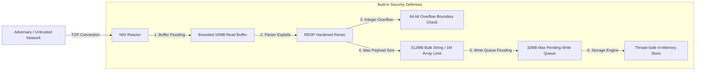

# Security Architecture & Threat Model

## 1. Overview & Threat Model

This document outlines the security profile, attack surface, input validation controls, and operational threat mitigations implemented in the Core Java 21 Redis clone. 

As an in-memory data store speaking the raw Redis Serialization Protocol (RESP), the server operates under the standard Redis trust model: **the database is designed to run in a trusted, isolated private network tier (VPC, private subnet, or localhost loopback). It must NEVER be exposed directly to the untrusted public Internet without an intervening authenticated reverse proxy or TLS tunnel.**

---

## 2. Attack Surface Analysis & Defensive Controls



### 2.1 Denial-of-Service via Memory Exhaustion (OOM)
- **Threat:** An adversary opens a TCP connection and transmits an endless stream of bytes without sending a terminating `\r\n`, forcing the server to dynamically resize its read buffer until JVM heap exhaustion occurs.
- **Mitigation:** The connection pipeline in [`ClientConnection.java`](file:///c:/Users/ASUS/OneDrive/Documents/New%20folder/src/com/redisclone/network/ClientConnection.java) strictly enforces `MAX_READ_BUFFER_CAPACITY = 16 * 1024 * 1024` (16 MB). Any connection exceeding this boundary without producing a decodable frame is immediately disconnected and its memory reclaimed.
- **Write Backpressure:** Similarly, slow-reading clients consuming large data dumps are bounded by `MAX_PENDING_WRITE_BYTES = 32 * 1024 * 1024` (32 MB). If the pending output queue exceeds 32 MB, the server sheds load rather than buffering infinitely.

### 2.2 Arithmetic Integer Overflow Exploitation
- **Threat:** Sending RESP integer lengths designed to wrap signed 64-bit integers (`Long.MAX_VALUE + 1`), potentially causing negative length bulk reads or memory corruption in downstream byte array allocations.
- **Mitigation:** [`RespParser.java:parseAsciiLong`](file:///c:/Users/ASUS/OneDrive/Documents/New%20folder/src/com/redisclone/resp/RespParser.java) evaluates:
  ```java
  if (result > (Long.MAX_VALUE - digit) / 10) {
      throw new ProtocolException("Integer overflow detected in RESP frame");
  }
  ```
  This guarantees that any overflow condition triggers an explicit `ProtocolException`, cleanly terminating the transaction without crashing the reactor thread.

### 2.3 Command Frame Size Restrictions
- **Threat:** An attacker transmits a frame requesting allocation of multi-gigabyte bulk strings (`$2147483647\r\n`), causing instant `OutOfMemoryError` on `new byte[len]`.
- **Mitigation:** Hard upper boundaries are enforced:
  - `MAX_BULK_STRING_LENGTH = 512 * 1024 * 1024` (512 MB, matching official Redis).
  - `MAX_ARRAY_ELEMENTS = 1_000_000` (1 million elements).
  Requests exceeding these limits are immediately rejected at the protocol parse boundary before memory allocation occurs.

### 2.4 Command Injection & Protocol Desynchronization
- **Threat:** HTTP Request Smuggling or RESP pipelining injection where HTTP payloads are sent to port 6379, embedding hidden Redis commands in POST bodies.
- **Mitigation:** The parser strictly validates the initial byte of every frame (`+`, `-`, `:`, `$`, `*`). Non-RESP characters (such as HTTP verbs `POST`, `GET / HTTP/1.1`) cause instant parsing failure and disconnect the client, preventing smuggling attacks.

---

## 3. Current Security Boundaries & Explicit Limitations

To maintain academic honesty and transparent engineering standards, the following security features are **not currently implemented** in this engine:

1. **Authentication (AUTH / ACLs):** The server does not currently evaluate password authentication or user role access control lists. Any client with network connectivity to the listening port has full access to the keyspace.
2. **Transport Layer Security (TLS/SSL):** Traffic across the TCP socket is transmitted in unencrypted plaintext RESP format.
3. **Command Renaming / Disabling:** High-risk operational commands (`FLUSHALL`, `SHUTDOWN`, `CONFIG`) cannot currently be disabled or renamed via configuration.

---

## 4. Production Hardening & Deployment Guidelines

For any real-world deployment, operators must adhere to the following network isolation checklist:

1. **Localhost / Private Binding:** Never bind to `0.0.0.0` in an untrusted environment. Bind explicitly to `127.0.0.1` or the private VPC subnet interface:
   ```cmd
   java -cp bin com.redisclone.server.RedisServer --host 127.0.0.1 --port 6379
   ```
2. **Network Firewalling:** Enforce strict firewall rules (e.g. `iptables`, AWS Security Groups, Windows Defender Firewall) allowing incoming traffic only from designated application servers.
3. **TLS Termination via Stunnel or Envoy:** If network traffic traverses untrusted segments, deploy an external sidecar proxy (e.g., Envoy, HAProxy, or `stunnel`) to terminate TLS before proxying plaintext TCP to the Redis clone.
4. **Memory Resource Constraints:** Launch the JVM with strict heap limits (`-Xms2g -Xmx4g -XX:+ExitOnOutOfMemoryError`) to guarantee bounded host memory consumption.
